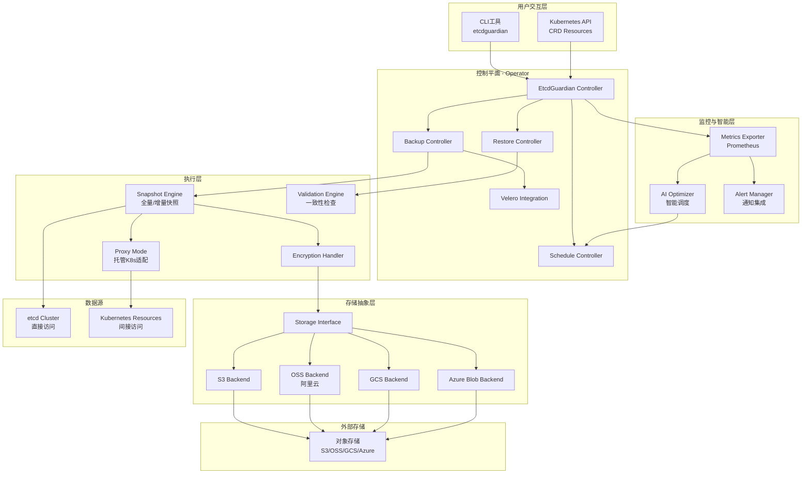
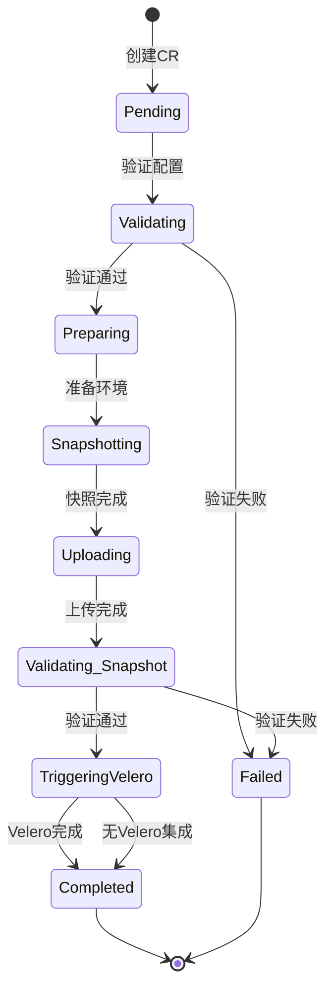
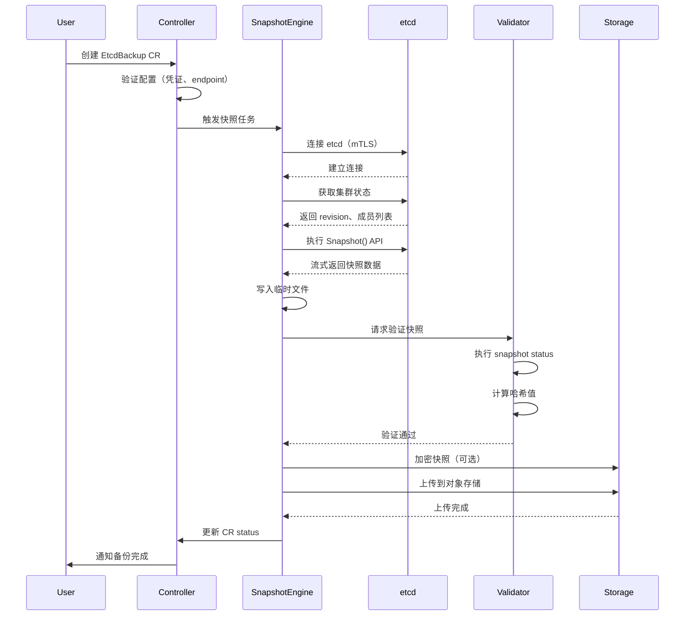
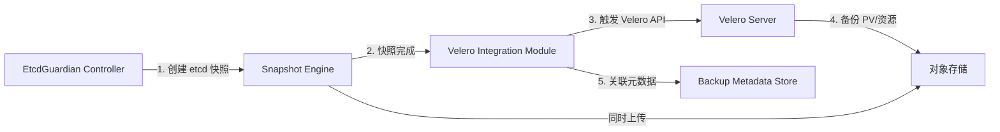
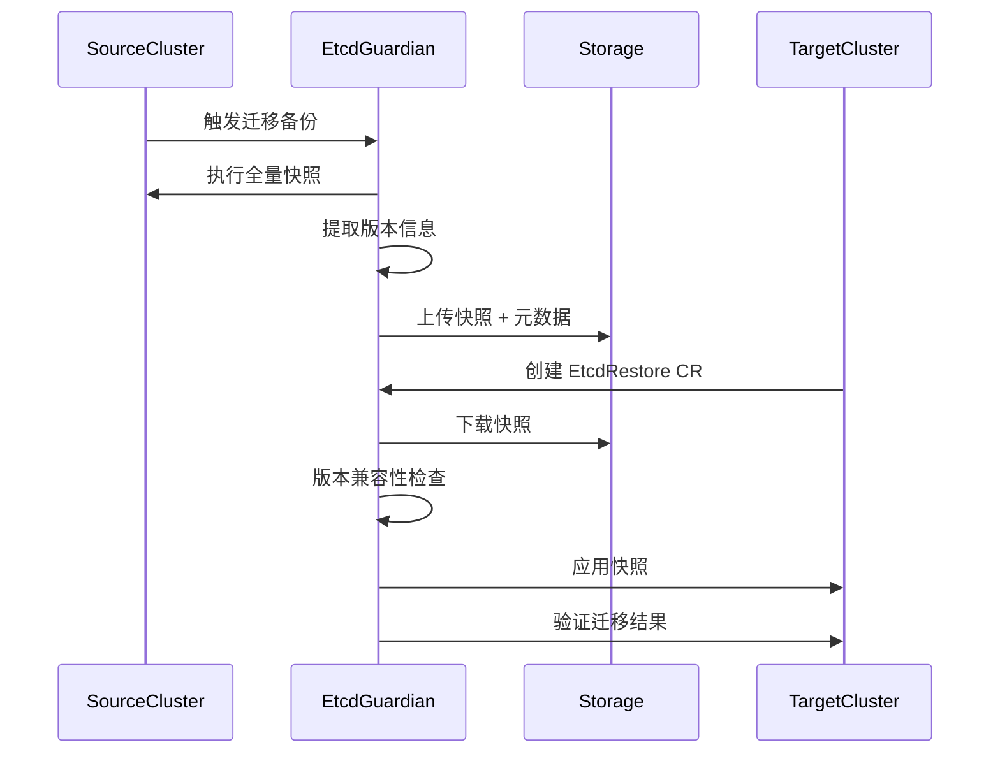

# EtcdGuardian 灾备恢复优化设计文档

## 1. 项目概述

### 1.1 项目背景与目标

EtcdGuardian 是一个生产级的 Kubernetes Operator 项目，旨在解决 Velero 在 etcd 备份领域的核心局限性。项目聚焦于以下关键问题的系统性解决方案：

**Velero 的核心局限**：
- 无法直接备份 etcd 内部状态（历史修订、compaction 元数据、低级配置）
- 托管 Kubernetes 环境兼容性不足（EKS、GKE、ACK 等无法完整访问 etcd）
- 恢复验证机制缺失（无自动一致性检查、增量恢复或历史版本管理）
- 大规模场景下的性能瓶颈（etcd 膨胀、API 服务器过载、不支持增量备份）

**项目核心目标**：
- 提供直接的 etcd 快照能力，捕获完整内部状态
- 支持托管 Kubernetes 环境（特别是阿里云 ACK）的代理模式
- 实现自动化验证、增量恢复和多版本管理
- 优化大规模备份性能，支持增量快照
- 与 Velero 深度集成同时保持独立运行能力
- 提供多租户隔离和自助备份功能
- 集成 AI 驱动的智能调度优化

### 1.2 技术栈约束

| 技术组件 | 版本要求 | 用途说明 |
|---------|---------|---------|
| Go | 1.21+ | 核心开发语言 |
| Operator SDK | v1.30+ | Operator 框架 |
| controller-runtime | 最新稳定版 | 控制器协调引擎 |
| etcd/clientv3 | v3.5+ | etcd 客户端交互 |
| Velero client-go | v1.12+ | Velero 集成 |
| Cobra | v1.7+ | CLI 工具框架 |
| Zap | v1.26+ | 结构化日志 |
| Prometheus client | v1.17+ | 监控指标 |
| aliyun-sdk-go | 最新版 | 阿里云服务集成 |
| Helm | v3.0+ | 部署打包 |

## 2. 系统架构设计

### 2.1 整体架构视图



### 2.2 核心组件职责划分

#### 2.2.1 控制器层

| 控制器名称 | 核心职责 | 关键逻辑 |
|-----------|---------|---------|
| Backup Controller | 协调 EtcdBackup CR 生命周期 | 解析备份策略、调度快照任务、管理保留策略、触发 Velero 集成 |
| Restore Controller | 协调 EtcdRestore CR 生命周期 | 执行恢复前钩子、应用快照、集群静止管理、版本兼容性检查 |
| Schedule Controller | 管理 cron 调度 | 解析 cron 表达式、触发定时备份、AI 调度优化接入点 |
| Tenant Controller | 多租户隔离管理 | RBAC 验证、命名空间级权限、审计日志记录 |

#### 2.2.2 执行引擎层

**Snapshot Engine（快照引擎）**：
- 全量快照：通过 etcdctl snapshot save 捕获完整状态
- 增量快照：基于 etcd revision 的差异备份，记录 watch 变更
- 元数据捕获：提取 compaction revision、历史修订范围、集群健康状态
- 并发控制：流式传输避免内存溢出，支持大规模 etcd（10GB+）

**Validation Engine（验证引擎）**：
- 快照完整性：执行 etcdctl snapshot status 检查
- 哈希一致性：比对 etcd 数据哈希值
- 恢复演练：在隔离环境验证快照可恢复性（可选）
- 版本兼容：检测 etcd API 版本差异

**Proxy Mode（代理模式）**：
- 触发条件：检测 etcd 直接访问失败（网络不可达、权限拒绝）
- 降级策略：通过 Kubernetes API 导出资源（ConfigMap、Secret、CRD 等）
- ACK 特殊处理：使用阿里云 SDK 获取托管 etcd 的受限访问权限
- 数据重构：从 K8s 资源反向构建 etcd 键值对

**Encryption Handler（加密处理器）**：
- 客户端加密：在上传前加密快照（AES-256-GCM）
- KMS 集成：支持 AWS KMS、阿里云 KMS
- 密钥管理：从 Kubernetes Secret 或 Vault 获取加密密钥
- 传输安全：使用 mTLS 与 etcd 通信

### 2.3 存储抽象设计

**接口定义**：
所有存储后端实现统一接口，包含以下能力契约：
- Upload：上传快照文件，支持分片上传（大文件优化）
- Download：下载指定版本快照
- List：列举存储桶中的快照清单
- Delete：按保留策略删除过期快照
- GetMetadata：获取快照元数据（大小、创建时间、etcd 版本）

**后端实现映射**：

| 存储后端 | 实现要点 | 特殊优化 |
|---------|---------|---------|
| S3 Compatible | 使用 aws-sdk-go-v2，支持 MinIO、AWS S3、Ceph | 多部分上传，预签名 URL |
| 阿里云 OSS | aliyun-oss-go-sdk，RAM 角色认证 | 分片上传优化，KMS 服务端加密，跨地域复制 |
| GCS | Google Cloud Storage SDK | 统一凭证管理 |
| Azure Blob | Azure SDK for Go | SAS Token 认证 |

**阿里云 OSS 特殊配置**：
- 凭证获取：支持 AccessKey/SecretKey、RAM 角色、STS 临时凭证
- 网络优化：内网 Endpoint 自动检测（VPC 环境）
- 加密选项：服务端 KMS 加密（自动密钥轮换）、客户端加密
- 生命周期管理：利用 OSS 生命周期规则自动归档冷数据

## 3. 自定义资源定义（CRD）

### 3.1 EtcdBackup CRD

**资源用途**：定义单次或周期性的 etcd 备份任务

**核心字段设计**：

| 字段路径 | 类型 | 必填 | 说明 |
|---------|------|------|------|
| spec.schedule | string | 否 | Cron 表达式（如 "0 2 * * *"），为空则执行一次性备份 |
| spec.backupMode | enum | 是 | 备份模式：Full（全量）、Incremental（增量） |
| spec.etcdEndpoints | []string | 否 | etcd 端点列表，为空则自动发现 |
| spec.etcdCertificates.ca | string | 否 | CA 证书 Secret 引用 |
| spec.etcdCertificates.cert | string | 否 | 客户端证书 Secret 引用 |
| spec.etcdCertificates.key | string | 否 | 客户端密钥 Secret 引用 |
| spec.storageLocation.provider | enum | 是 | 存储提供商：S3、OSS、GCS、Azure |
| spec.storageLocation.bucket | string | 是 | 存储桶名称 |
| spec.storageLocation.prefix | string | 否 | 存储路径前缀 |
| spec.storageLocation.region | string | 是 | 存储区域 |
| spec.storageLocation.endpoint | string | 否 | 自定义 Endpoint（MinIO、私有云） |
| spec.storageLocation.credentialsSecret | string | 是 | 存储凭证 Secret 名称 |
| spec.encryption.enabled | bool | 否 | 是否启用加密（默认 false） |
| spec.encryption.kmsKeyID | string | 否 | KMS 密钥 ID（启用 KMS 时） |
| spec.encryption.encryptionSecret | string | 否 | 客户端加密密钥 Secret |
| spec.retentionPolicy.maxBackups | int | 否 | 保留最大备份数量 |
| spec.retentionPolicy.maxAge | duration | 否 | 保留最大时长（如 "720h"） |
| spec.validation.enabled | bool | 否 | 是否自动验证（默认 true） |
| spec.validation.consistencyCheck | bool | 否 | 是否执行一致性检查 |
| spec.veleroIntegration.enabled | bool | 否 | 是否触发 Velero 备份 |
| spec.veleroIntegration.backupName | string | 否 | 关联的 Velero Backup 名称 |
| spec.namespaceSelector | LabelSelector | 否 | 多租户：限定备份的命名空间 |
| spec.hooks.preBackup | []Hook | 否 | 备份前钩子脚本 |
| spec.hooks.postBackup | []Hook | 否 | 备份后钩子脚本 |
| status.phase | enum | - | 当前阶段：Pending、Running、Completed、Failed |
| status.snapshotSize | int64 | - | 快照大小（字节） |
| status.snapshotLocation | string | - | 存储位置完整路径 |
| status.etcdRevision | int64 | - | etcd 修订版本号 |
| status.validationResult | object | - | 验证结果详情 |
| status.startTime | time | - | 开始时间 |
| status.completionTime | time | - | 完成时间 |

**状态流转**：



### 3.2 EtcdRestore CRD

**资源用途**：从快照恢复 etcd 数据

**核心字段设计**：

| 字段路径 | 类型 | 必填 | 说明 |
|---------|------|------|------|
| spec.backupName | string | 是 | 关联的 EtcdBackup 资源名称 |
| spec.snapshotLocation | string | 否 | 直接指定快照路径（优先级高于 backupName） |
| spec.restoreMode | enum | 是 | 恢复模式：Full（全量）、Incremental（增量）、PointInTime（时间点） |
| spec.targetRevision | int64 | 否 | 目标 etcd revision（时间点恢复） |
| spec.etcdCluster.endpoints | []string | 是 | 目标 etcd 集群端点 |
| spec.etcdCluster.dataDir | string | 是 | etcd 数据目录路径 |
| spec.quiesceCluster | bool | 否 | 是否静止集群（默认 true） |
| spec.preRestoreHooks | []Hook | 否 | 恢复前钩子（如停止应用） |
| spec.postRestoreHooks | []Hook | 否 | 恢复后钩子（如重启应用） |
| spec.versionCompatibility.check | bool | 否 | 是否检查版本兼容性（默认 true） |
| spec.versionCompatibility.allowMismatch | bool | 否 | 是否允许版本不匹配 |
| spec.namespaceFilter | []string | 否 | 多租户：仅恢复指定命名空间 |
| status.phase | enum | - | 阶段：Pending、Quiescing、Restoring、Validating、Completed、Failed |
| status.restoredRevision | int64 | - | 实际恢复的 revision |
| status.restoredKeys | int | - | 恢复的键数量 |
| status.errors | []string | - | 错误信息列表 |

### 3.3 EtcdBackupSchedule CRD

**资源用途**：管理周期性备份的高级配置（可选，与 EtcdBackup 的 schedule 字段互补）

**核心字段**：

| 字段路径 | 类型 | 说明 |
|---------|------|------|
| spec.schedule | string | Cron 表达式 |
| spec.backupTemplate | EtcdBackupSpec | 备份模板配置 |
| spec.suspend | bool | 暂停调度 |
| spec.aiOptimization.enabled | bool | 启用 AI 驱动的调度优化 |
| spec.aiOptimization.minInterval | duration | 最小备份间隔 |
| spec.aiOptimization.maxInterval | duration | 最大备份间隔 |
| status.lastBackupTime | time | 上次备份时间 |
| status.nextBackupTime | time | 下次备份时间（AI 优化后） |
| status.backupHistory | []BackupRef | 历史备份引用 |

## 4. 核心功能设计

### 4.1 自动化 etcd 快照

#### 4.1.1 全量快照流程



#### 4.1.2 增量快照设计

**实现原理**：
- 基础依赖：etcd 的 watch 机制和 revision 版本号
- 初始快照：创建全量快照作为基线，记录 baseline revision
- 增量捕获：使用 Watch API 监听从 baseline revision 到当前的所有变更事件
- 事件记录：序列化 Put、Delete 事件到增量文件
- 恢复重放：按顺序应用增量变更到基线快照

**数据结构**：

增量快照文件包含以下元数据：
- 基线快照引用（base snapshot ID）
- 起始 revision 和结束 revision
- 事件列表（操作类型、键、值、修订号）
- 事件数量和压缩后大小

**性能优化**：
- 事件批处理：累积 1000 个事件后批量写入
- 压缩存储：使用 snappy 压缩事件数据
- 合并策略：自动合并多个小增量为新的全量快照（如累计 10 个增量）

#### 4.1.3 托管 Kubernetes 代理模式

**场景识别**：

判断是否进入代理模式的条件：
1. etcd endpoint 连接超时（5 秒）
2. TLS 握手失败（证书验证拒绝）
3. 权限错误（403 Forbidden）
4. 环境检测：识别 EKS、GKE、ACK 标识

**降级备份策略**：

| 数据类型 | 备份方法 | 局限性 |
|---------|---------|--------|
| 核心资源 | 通过 K8s API 导出 JSON | 缺失 etcd 内部元数据（如历史 revision） |
| CRD 实例 | 遍历所有 CRD，导出所有实例 | 无法捕获已删除资源的历史 |
| Secret/ConfigMap | 批量导出所有命名空间 | 性能受 API 限流影响 |
| 集群配置 | 导出 kubeadm config、证书 | 无法获取 etcd compaction 状态 |

**阿里云 ACK 特殊处理**：

使用阿里云 SDK 的增强访问：
- 调用 OpenAPI：DescribeClusterDetail 获取托管 etcd 元数据
- STS 授权：通过临时凭证访问受限端点
- 日志抓取：从 ACK 控制台日志提取 etcd 健康信息
- 跨地域：支持跨地域集群的备份同步

### 4.2 多租户隔离

#### 4.2.1 RBAC 模型

**角色定义**：

| 角色名称 | ClusterRole | 命名空间权限 | 允许操作 |
|---------|------------|------------|---------|
| etcd-admin | 是 | 全局 | 管理所有 EtcdBackup/Restore，访问所有命名空间 |
| etcd-tenant-operator | 否 | 限定命名空间 | 仅在自己的命名空间创建 EtcdBackup，只能备份本命名空间资源 |
| etcd-viewer | 否 | 限定命名空间 | 只读访问备份状态 |

**权限控制逻辑**：

在 Backup Controller 的 Reconcile 循环中注入权限检查：
1. 解析 CR 的创建者（通过 kubectl 的 user info 注解）
2. 检查创建者的 RBAC 权限：
   - 如果 spec.namespaceSelector 为空，要求 cluster-admin 权限
   - 如果指定命名空间，验证创建者对这些命名空间有 get/list 权限
3. 拒绝越权请求：返回 Forbidden 错误，更新 CR status

#### 4.2.2 命名空间级快照

**实现方案**：

通过 etcd 键前缀过滤实现命名空间隔离：
- Kubernetes 资源在 etcd 中的键格式：`/registry/<resource>/<namespace>/<name>`
- 备份时使用 etcd Range API 的前缀查询：`prefix=/registry/*/target-namespace/`
- 生成租户特定快照：仅包含匹配前缀的键值对

**标签选择器支持**：

允许用户通过标签进一步过滤：
- 先通过 K8s API 查询带标签的资源列表
- 提取资源的 etcd 键路径
- 使用 etcd Txn API 批量读取这些键

**审计日志**：

记录以下操作到 Kubernetes Event 和结构化日志：
- 谁（用户名、ServiceAccount）
- 何时（时间戳）
- 做了什么（创建备份、恢复、删除）
- 影响范围（命名空间、资源数量）
- 结果（成功、失败原因）

### 4.3 Velero 集成

#### 4.3.1 集成架构



**触发时机**：

在 EtcdBackup CR 中配置 `spec.veleroIntegration.enabled: true` 时：
1. 完成 etcd 快照并上传后
2. 调用 Velero client-go 创建 Velero Backup 资源
3. 传递标签：`etcdguardian.io/backup-ref: <etcd-backup-name>`
4. 等待 Velero Backup 完成，更新 EtcdBackup 的 status

**元数据关联**：

在 EtcdBackup status 中记录：
- veleroBackupName：关联的 Velero Backup 名称
- veleroBackupUID：Velero Backup 的 UID
- combinedBackupLocation：包含 etcd 快照和 Velero 备份的统一路径

#### 4.3.2 CLI Wrapper 设计

**命令结构**：

扩展 etcdguardian CLI 以简化 Velero 配置：
```
etcdguardian velero install
  --storage-provider oss
  --oss-bucket my-backup-bucket
  --oss-access-key-id <AK>
  --oss-access-key-secret <SK>
  --oss-region cn-hangzhou
  --enable-etcd-integration
```

**自动化操作**：

执行以下步骤：
1. 创建 Velero 命名空间和 ServiceAccount
2. 生成存储凭证 Secret
3. 安装 Velero Server（通过 Helm 或 kubectl apply）
4. 配置 BackupStorageLocation（指向 OSS）
5. 创建 VolumeSnapshotLocation（如果使用 CSI）
6. 部署 EtcdGuardian Operator 并启用 Velero 集成

**预配置模板**：

提供常见场景的配置模板：
- 集群内 MinIO：自动部署 MinIO 实例作为存储后端
- 阿里云 ACK + OSS：使用 RAM 角色免密认证
- AWS EKS + S3：使用 IRSA（IAM Roles for Service Accounts）

### 4.4 高级灾备功能

#### 4.4.1 etcd 监控集成

**Prometheus 指标设计**：

| 指标名称 | 类型 | 标签 | 说明 |
|---------|------|------|------|
| etcdguardian_backup_duration_seconds | Histogram | backup_mode, status | 备份耗时分布 |
| etcdguardian_backup_size_bytes | Gauge | backup_name | 快照大小 |
| etcdguardian_backup_total | Counter | status | 备份总数（成功/失败） |
| etcdguardian_etcd_db_size_bytes | Gauge | endpoint | etcd 数据库大小 |
| etcdguardian_etcd_revision | Gauge | endpoint | 当前 etcd revision |
| etcdguardian_validation_failures_total | Counter | reason | 验证失败次数 |
| etcdguardian_restore_duration_seconds | Histogram | restore_mode | 恢复耗时 |

**告警规则示例**：

定义 Prometheus AlertManager 规则：
- BackupFailure：连续 2 次备份失败
- BackupSizeSpiking：快照大小增长超过 50%
- EtcdDbGrowing：etcd 数据库大小超过阈值（如 8GB）
- ValidationFailure：快照验证失败
- NoRecentBackup：最近 24 小时无成功备份

**通知集成**：

支持多种通知渠道：
- Slack Webhook：发送格式化消息到指定频道
- 邮件通知：通过 SMTP 发送详细报告
- Kubernetes Event：创建 Warning 级别事件
- 自定义 Webhook：POST 备份状态到用户 API

#### 4.4.2 AI 驱动的智能调度

**机器学习模型**：

使用时间序列预测模型（如 ARIMA 或简化的 LSTM）：
- 输入特征：
  - 历史备份大小变化
  - etcd 写入速率（keys/sec）
  - 集群负载（CPU、内存）
  - 业务时间模式（工作日 vs 周末）
- 输出预测：
  - 下次备份的最佳时间窗口
  - 预期快照大小
  - 备份耗时估算

**动态调度策略**：

根据预测结果调整 cron 调度：
- 低活动期（预测变更少）：延长备份间隔（如从 1 小时延长到 4 小时）
- 高活动期（大量写入）：缩短间隔（如从 4 小时缩短到 1 小时）
- 资源避让：避开集群高负载时段（如业务高峰期）

**降级保护**：

如果 AI 模型不可用或预测异常：
- 回退到用户配置的固定 cron 表达式
- 使用保守的默认间隔（如每 6 小时）
- 记录降级原因到日志

#### 4.4.3 跨集群迁移

**迁移流程**：



**版本兼容性检查**：

在恢复前验证：
- etcd 版本：源集群和目标集群的 etcd 版本差异
  - 允许：3.4.x → 3.5.x（前向兼容）
  - 警告：3.5.x → 3.4.x（可能丢失新特性）
  - 拒绝：跨大版本（如 3.3.x → 3.5.x）
- Kubernetes 版本：检测 API 弃用（如 v1beta1 → v1）
- CRD 版本：验证目标集群是否安装了相同的 CRD

**数据转换**：

如果版本不兼容但用户强制执行：
- API 版本转换：自动升级旧 API 对象到新版本
- 字段映射：处理字段重命名或废弃
- 丢弃不兼容数据：记录警告日志

**阿里云跨地域迁移**：

针对 ACK 的特殊优化：
- 自动选择源和目标地域的 OSS 内网 Endpoint
- 使用 OSS 跨地域复制加速数据传输
- 集成阿里云 VPN 网关实现集群互通

## 5. 部署与运维

### 5.1 Helm Chart 设计

**Chart 结构**：

```
etcdguardian/
├── Chart.yaml
├── values.yaml
├── templates/
│   ├── operator-deployment.yaml
│   ├── rbac.yaml
│   ├── crds/
│   │   ├── etcdbackup-crd.yaml
│   │   ├── etcdrestore-crd.yaml
│   │   └── etcdbackupschedule-crd.yaml
│   ├── configmap.yaml
│   ├── secret.yaml（示例凭证）
│   ├── servicemonitor.yaml（Prometheus）
│   └── validatingwebhook.yaml
└── README.md
```

**values.yaml 核心配置**：

| 配置项 | 默认值 | 说明 |
|-------|--------|------|
| image.repository | etcdguardian/operator | Operator 镜像仓库 |
| image.tag | latest | 镜像版本 |
| replicas | 1 | Operator 副本数（高可用时设为 2） |
| resources.requests.cpu | 100m | CPU 请求 |
| resources.requests.memory | 128Mi | 内存请求 |
| etcd.endpoints | [] | 默认 etcd 端点（可覆盖） |
| etcd.certificates.create | true | 是否自动创建证书 Secret |
| storage.defaultProvider | s3 | 默认存储后端 |
| storage.s3.bucket | "" | S3 存储桶 |
| storage.oss.enabled | false | 启用阿里云 OSS |
| storage.oss.bucket | "" | OSS 存储桶 |
| storage.oss.region | cn-hangzhou | OSS 地域 |
| storage.oss.useRAMRole | false | 使用 RAM 角色认证 |
| velero.integration.enabled | false | 启用 Velero 集成 |
| monitoring.prometheus.enabled | true | 启用 Prometheus 监控 |
| aiOptimization.enabled | false | 启用 AI 调度优化 |
| webhook.enabled | true | 启用 admission webhook |

**安装命令**：

```
helm repo add etcdguardian https://etcdguardian.io/charts
helm install etcdguardian etcdguardian/etcdguardian \
  --namespace etcd-guardian-system \
  --create-namespace \
  --set storage.oss.enabled=true \
  --set storage.oss.bucket=my-etcd-backups \
  --set storage.oss.region=cn-beijing
```

### 5.2 离线部署支持

**离线包内容**：

- Operator 镜像 tarball：docker save 导出
- Helm Chart：完整的 chart 压缩包
- 依赖镜像：包括 busybox、etcd client 等
- 离线文档：PDF 格式的部署指南

**部署流程**：

1. 将镜像 load 到内网镜像仓库
2. 修改 values.yaml 指向内网镜像地址
3. 使用 helm install --set image.repository=<内网地址>
4. 配置内网对象存储（如 MinIO）

### 5.3 安全加固

**mTLS 配置**：

与 etcd 通信必须启用双向 TLS：
- CA 证书验证：验证 etcd 服务器证书链
- 客户端证书：Operator 使用客户端证书认证身份
- 证书轮换：支持自动检测证书过期并重新加载

**密钥管理**：

敏感信息存储方案：
- Kubernetes Secret：存储存储后端凭证、etcd 证书
- HashiCorp Vault：集成 Vault Agent Injector 自动注入密钥
- 阿里云 KMS：使用 KMS 密钥加密 Secret at rest

**RBAC 最小权限**：

Operator ServiceAccount 仅需以下权限：
- 核心权限：etcdbackups、etcdrestores 的 CRUD
- 只读权限：访问 Secrets（读取凭证）、ConfigMaps
- 事件权限：创建 Event 对象
- 租户模式：仅限指定命名空间（非 cluster-admin）

## 6. 测试策略

### 6.1 单元测试

**覆盖率目标**：≥80%

**测试分类**：

| 测试类型 | 工具 | 重点模块 |
|---------|------|---------|
| Controller 逻辑 | controller-runtime/envtest | Reconcile 循环、状态更新 |
| 存储抽象 | Go testing + mockgen | 接口实现、错误处理 |
| 快照引擎 | 内存 etcd（embed etcd） | 全量/增量快照、验证 |
| 加密模块 | Go crypto 标准库 | 加密/解密、KMS 模拟 |

**Mock 策略**：

使用 mockgen 生成 mock 对象：
- Storage Interface：模拟上传失败、网络超时
- etcd clientv3：模拟连接失败、权限错误
- Velero Client：模拟 Velero API 调用

### 6.2 端到端测试

**测试环境**：

使用 kind（Kubernetes in Docker）搭建测试集群：
- 单节点集群：快速测试基本功能
- 多节点集群：测试 etcd 高可用场景
- 模拟 ACK：配置网络策略限制 etcd 访问

**测试场景**：

| 场景 | 验证点 | 预期结果 |
|------|--------|---------|
| 全量备份 | 创建 EtcdBackup CR | Status 变为 Completed，快照上传成功 |
| 增量备份 | 在全量快照后创建增量 | 仅捕获增量变更，文件较小 |
| 自动验证 | 备份后检查 status.validationResult | 哈希一致性通过 |
| 恢复测试 | 删除部分数据后恢复 | 数据完整恢复，集群健康 |
| 代理模式 | 模拟 etcd 不可达 | 自动降级到 K8s API 导出 |
| 多租户 | 非管理员用户创建跨命名空间备份 | 返回权限错误 |
| Velero 集成 | 启用集成后备份 | 同时生成 etcd 和 Velero 备份 |
| 故障注入 | 模拟网络分区、etcd crash | 正确处理错误，更新 status |

**性能基准测试**：

测试大规模场景：
- 10GB etcd 数据库备份耗时
- 100 个并发备份任务
- 1000 次增量快照的累积大小

### 6.3 混沌测试

**混沌工具**：集成 Chaos Mesh

**测试场景**：
- Pod 故障：随机删除 Operator Pod
- 网络延迟：注入 100ms 延迟到 etcd 连接
- 存储故障：模拟对象存储 503 错误
- 时钟偏移：调整系统时间测试 cron 调度

## 7. 文档与社区

### 7.1 文档结构

**README.md**：

包含以下章节：
- 项目介绍：简洁描述 EtcdGuardian 的核心价值
- 快速开始：5 分钟内完成安装和第一次备份
- 架构概览：Mermaid 架构图
- 使用示例：
  - 创建全量备份
  - 创建增量备份
  - 从快照恢复
  - 配置 Velero 集成
  - 阿里云 ACK + OSS 部署示例
- API 参考：指向 godoc 链接
- 故障排查：常见问题解答
- 贡献指南：链接到 CONTRIBUTING.md
- 许可证：Apache 2.0

**API 文档**：

使用 godoc 自动生成：
- 每个 CRD 字段的详细说明
- 控制器接口文档
- 存储抽象层 API
- CLI 命令参考

**运维手册**：

独立文档 OPERATIONS.md：
- 监控指标解释
- 告警规则配置
- 性能调优建议
- 灾备演练流程
- 版本升级指南

### 7.2 社区建设

**贡献指南 CONTRIBUTING.md**：

包含：
- 开发环境搭建
- 代码规范（使用 golangci-lint）
- 提交规范（Conventional Commits）
- PR 流程
- Issue 模板（Bug、Feature Request）

**GitHub Actions CI/CD**：

自动化流程：
- 代码检查：golangci-lint、go vet
- 单元测试：运行所有测试并生成覆盖率报告
- 构建镜像：多架构（amd64、arm64）
- 端到端测试：在 kind 集群中验证
- 发布：自动创建 GitHub Release 和 Helm Chart

**行为准则 CODE_OF_CONDUCT.md**：

参考 Contributor Covenant 标准

**许可证**：

Apache License 2.0，允许商业使用和修改

## 8. 实施路线图

### 8.1 MVP（最小可行产品）阶段

**时间估算**：4-6 周

**核心功能**：
- Operator 框架搭建（Operator SDK 初始化）
- EtcdBackup CRD 和 Controller（仅全量备份）
- 单一存储后端实现（S3 Compatible）
- etcd 直接快照（使用 etcdctl）
- 基础验证（snapshot status）
- Helm Chart 基础版本
- 单元测试覆盖核心逻辑

**验收标准**：
- 成功备份 etcd 到 S3
- 从快照恢复 etcd
- Helm 一键部署

### 8.2 增强功能阶段

**时间估算**：6-8 周

**新增功能**：
- 增量备份实现
- 多存储后端（OSS、GCS、Azure）
- EtcdRestore CRD 和 Controller
- 托管 Kubernetes 代理模式
- 加密支持（客户端加密 + KMS）
- Prometheus 监控集成
- 多租户 RBAC
- CLI 工具（Cobra）

**验收标准**：
- 增量备份大小 < 10% 全量快照
- 代理模式在 EKS 上成功运行
- Prometheus 正确采集指标

### 8.3 高级特性阶段

**时间估算**：4-6 周

**新增功能**：
- Velero 深度集成
- AI 驱动的智能调度
- 跨集群迁移工具
- 告警通知集成
- 端到端测试完整覆盖
- 性能优化（大规模测试）
- 阿里云 ACK 完整适配

**验收标准**：
- 10GB etcd 备份 < 5 分钟
- AI 调度减少 30% 备份次数
- ACK 环境完整功能验证

### 8.4 生产就绪阶段

**时间估算**：2-3 周

**完善项**：
- 安全加固（漏洞扫描、RBAC 审计）
- 文档完善（README、API 文档、运维手册）
- 社区准备（GitHub 模板、CI/CD）
- 性能基准报告
- 离线部署包
- 演示视频和博客文章

**验收标准**：
- 通过安全扫描（无 HIGH/CRITICAL 漏洞）
- 文档完整度 100%
- 至少 3 个外部贡献者测试反馈

## 9. 风险与挑战

### 9.1 技术风险

| 风险项 | 影响 | 缓解策略 |
|-------|------|---------|
| etcd 版本碎片化 | 不同版本的快照格式不兼容 | 实现版本检测和自动转换逻辑 |
| 托管 K8s 限制 | 部分云厂商完全禁止 etcd 访问 | 提供纯 K8s API 模式作为降级方案 |
| 大规模性能 | 100GB+ etcd 备份耗时过长 | 流式传输、分片上传、增量优化 |
| 加密密钥管理 | 密钥泄露导致备份不可用 | 多层加密、密钥轮换、审计日志 |
| 并发冲突 | 多个备份任务同时修改 etcd | 使用分布式锁（etcd lease）协调 |

### 9.2 运维挑战

| 挑战 | 场景 | 解决方案 |
|------|------|---------|
| 恢复窗口 | 大规模集群恢复需要静止业务 | 提供金丝雀恢复（先验证小范围） |
| 存储成本 | 频繁全量备份导致高存储费用 | 智能保留策略、增量备份、自动归档 |
| 跨地域延迟 | 跨地域恢复下载缓慢 | 使用 CDN 加速、跨地域复制 |
| 监控盲区 | 备份失败但未及时发现 | 主动健康检查、心跳机制、多渠道告警 |

### 9.3 合规与安全

**数据主权**：
- 确保备份数据存储在用户指定的地域
- 支持数据加密满足 GDPR、等保 2.0 要求

**审计要求**：
- 记录所有敏感操作（备份、恢复、删除）
- 集成企业审计系统（Syslog、Splunk）

## 10. 成功指标

### 10.1 技术指标

| 指标 | 目标值 | 测量方法 |
|------|--------|---------|
| 备份成功率 | ≥99.9% | Prometheus 指标统计 |
| 恢复成功率 | ≥99.5% | 端到端测试通过率 |
| 备份耗时（10GB） | <5 分钟 | 性能基准测试 |
| 增量备份大小 | <全量 10% | 实际数据分析 |
| 代码覆盖率 | ≥80% | Go test -cover |
| 漏洞数量 | 0 HIGH/CRITICAL | Trivy/Snyk 扫描 |

### 10.2 用户指标

| 指标 | 目标值 | 测量方法 |
|------|--------|---------|
| GitHub Stars | 500+ （6 个月） | GitHub 统计 |
| 生产部署 | 50+ 集群 | 用户反馈、案例研究 |
| 社区贡献者 | 10+ | GitHub Contributors |
| 文档完整度 | 用户评分 ≥4.5/5 | 问卷调查 |
| 平均问题响应时间 | <24 小时 | GitHub Issues 统计 |

## 11. 关键决策记录

### 11.1 为什么选择 Operator SDK 而非 Kubebuilder

**决策**：使用 Operator SDK

**理由**：
- Operator SDK 基于 Kubebuilder，提供更丰富的脚手架
- 内置 Helm Operator、Ansible Operator 支持（未来扩展）
- 更好的 OLM（Operator Lifecycle Manager）集成
- 活跃的社区和更多的示例

### 11.2 增量备份实现方案选择

**备选方案**：
1. 基于 etcd watch API
2. 基于数据库增量日志
3. 基于文件系统快照（如 LVM）

**决策**：选择方案 1（etcd watch API）

**理由**：
- 原生支持，无需外部依赖
- 可精确捕获从指定 revision 的所有变更
- 跨平台兼容性好（不依赖文件系统特性）
- 可实现精确的时间点恢复

### 11.3 阿里云 OSS vs 通用 S3 接口

**决策**：同时支持 OSS SDK 和 S3 兼容接口

**理由**：
- OSS SDK 提供更好的性能优化（分片上传、断点续传）
- OSS SDK 原生支持 RAM 角色、STS 临时凭证
- S3 兼容接口保留通用性，降低迁移成本
- 通过存储抽象层统一两种实现

### 11.4 AI 优化的必要性

**决策**：作为可选特性实现，默认关闭

**理由**：
- 增加系统复杂度，需要额外的依赖和资源
- 对于小规模集群，固定调度已足够
- 可通过配置灵活启用，满足高级用户需求
- 未来可独立演进为 AI 调度服务

## 12. 附录

### 12.1 术语表

| 术语 | 定义 |
|------|------|
| etcd | Kubernetes 的分布式键值存储，存储集群所有状态 |
| Revision | etcd 的全局单调递增版本号，每次修改都会增加 |
| Compaction | etcd 清理历史版本以回收空间的操作 |
| Quiesce | 静止集群，暂停写入操作以确保一致性 |
| mTLS | 双向 TLS 认证，客户端和服务器互相验证证书 |
| RAM 角色 | 阿里云的身份管理，类似 AWS IAM 角色 |
| OLM | Operator Lifecycle Manager，K8s Operator 的包管理器 |

### 12.2 参考资源

**官方文档**：
- etcd 官方文档：https://etcd.io/docs/
- Operator SDK：https://sdk.operatorframework.io/
- Velero 文档：https://velero.io/docs/
- 阿里云 OSS SDK：https://help.aliyun.com/product/31815.html

**相关项目**：
- etcdadm：etcd 集群管理工具
- etcd-operator：CoreOS 的 etcd Operator（已归档，可参考设计）
- k8s-snapshots：Kubernetes 快照工具

**技术博客**：
- "etcd Snapshot and Restore"：etcd 官方博客
- "Kubernetes Disaster Recovery"：CNCF 案例研究

### 12.3 示例配置

**EtcdBackup CR 示例（阿里云 OSS）**：

```yaml
apiVersion: etcdguardian.io/v1alpha1
kind: EtcdBackup
metadata:
  name: daily-backup
  namespace: etcd-guardian-system
spec:
  schedule: "0 2 * * *"
  backupMode: Full
  storageLocation:
    provider: OSS
    bucket: my-etcd-backups
    region: cn-hangzhou
    credentialsSecret: oss-credentials
  encryption:
    enabled: true
    kmsKeyID: "acs:kms:cn-hangzhou:123456:key/abc-def"
  retentionPolicy:
    maxBackups: 30
    maxAge: 720h
  validation:
    enabled: true
    consistencyCheck: true
  veleroIntegration:
    enabled: true
```

**EtcdRestore CR 示例**：

```yaml
apiVersion: etcdguardian.io/v1alpha1
kind: EtcdRestore
metadata:
  name: restore-from-incident
  namespace: etcd-guardian-system
spec:
  backupName: daily-backup-20260112
  restoreMode: Full
  etcdCluster:
    endpoints:
      - https://etcd-0:2379
      - https://etcd-1:2379
      - https://etcd-2:2379
    dataDir: /var/lib/etcd
  quiesceCluster: true
  preRestoreHooks:
    - name: stop-apiserver
      type: Exec
      exec:
        command: ["systemctl", "stop", "kube-apiserver"]
  postRestoreHooks:
    - name: start-apiserver
      type: Exec
      exec:
        command: ["systemctl", "start", "kube-apiserver"]
  versionCompatibility:
    check: true
    allowMismatch: false
```
| Zap | v1.26+ | 结构化日志 |
| Prometheus client | v1.17+ | 监控指标 |
| aliyun-sdk-go | 最新版 | 阿里云服务集成 |
| Helm | v3.0+ | 部署打包 |

## 2. 系统架构设计

### 2.1 整体架构视图


### 2.2 核心组件职责划分

#### 2.2.1 控制器层

| 控制器名称 | 核心职责 | 关键逻辑 |
|-----------|---------|---------|
| Backup Controller | 协调 EtcdBackup CR 生命周期 | 解析备份策略、调度快照任务、管理保留策略、触发 Velero 集成 |
| Restore Controller | 协调 EtcdRestore CR 生命周期 | 执行恢复前钩子、应用快照、集群静止管理、版本兼容性检查 |
| Schedule Controller | 管理 cron 调度 | 解析 cron 表达式、触发定时备份、AI 调度优化接入点 |
| Tenant Controller | 多租户隔离管理 | RBAC 验证、命名空间级权限、审计日志记录 |

#### 2.2.2 执行引擎层

**Snapshot Engine（快照引擎）**：
- 全量快照：通过 etcdctl snapshot save 捕获完整状态
- 增量快照：基于 etcd revision 的差异备份，记录 watch 变更
- 元数据捕获：提取 compaction revision、历史修订范围、集群健康状态
- 并发控制：流式传输避免内存溢出，支持大规模 etcd（10GB+）

**Validation Engine（验证引擎）**：
- 快照完整性：执行 etcdctl snapshot status 检查
- 哈希一致性：比对 etcd 数据哈希值
- 恢复演练：在隔离环境验证快照可恢复性（可选）
- 版本兼容：检测 etcd API 版本差异

**Proxy Mode（代理模式）**：
- 触发条件：检测 etcd 直接访问失败（网络不可达、权限拒绝）
- 降级策略：通过 Kubernetes API 导出资源（ConfigMap、Secret、CRD 等）
- ACK 特殊处理：使用阿里云 SDK 获取托管 etcd 的受限访问权限
- 数据重构：从 K8s 资源反向构建 etcd 键值对

**Encryption Handler（加密处理器）**：
- 客户端加密：在上传前加密快照（AES-256-GCM）
- KMS 集成：支持 AWS KMS、阿里云 KMS
- 密钥管理：从 Kubernetes Secret 或 Vault 获取加密密钥
- 传输安全：使用 mTLS 与 etcd 通信

### 2.3 存储抽象设计

**接口定义**：
所有存储后端实现统一接口，包含以下能力契约：
- Upload：上传快照文件，支持分片上传（大文件优化）
- Download：下载指定版本快照
- List：列举存储桶中的快照清单
- Delete：按保留策略删除过期快照
- GetMetadata：获取快照元数据（大小、创建时间、etcd 版本）

**后端实现映射**：

| 存储后端 | 实现要点 | 特殊优化 |
|---------|---------|---------|
| S3 Compatible | 使用 aws-sdk-go-v2，支持 MinIO、AWS S3、Ceph | 多部分上传，预签名 URL |
| 阿里云 OSS | aliyun-oss-go-sdk，RAM 角色认证 | 分片上传优化，KMS 服务端加密，跨地域复制 |
| GCS | Google Cloud Storage SDK | 统一凭证管理 |
| Azure Blob | Azure SDK for Go | SAS Token 认证 |

**阿里云 OSS 特殊配置**：
- 凭证获取：支持 AccessKey/SecretKey、RAM 角色、STS 临时凭证
- 网络优化：内网 Endpoint 自动检测（VPC 环境）
- 加密选项：服务端 KMS 加密（自动密钥轮换）、客户端加密
- 生命周期管理：利用 OSS 生命周期规则自动归档冷数据

## 3. 自定义资源定义（CRD）

### 3.1 EtcdBackup CRD

**资源用途**：定义单次或周期性的 etcd 备份任务

**核心字段设计**：

| 字段路径 | 类型 | 必填 | 说明 |
|---------|------|------|------|
| spec.schedule | string | 否 | Cron 表达式（如 "0 2 * * *"），为空则执行一次性备份 |
| spec.backupMode | enum | 是 | 备份模式：Full（全量）、Incremental（增量） |
| spec.etcdEndpoints | []string | 否 | etcd 端点列表，为空则自动发现 |
| spec.etcdCertificates.ca | string | 否 | CA 证书 Secret 引用 |
| spec.etcdCertificates.cert | string | 否 | 客户端证书 Secret 引用 |
| spec.etcdCertificates.key | string | 否 | 客户端密钥 Secret 引用 |
| spec.storageLocation.provider | enum | 是 | 存储提供商：S3、OSS、GCS、Azure |
| spec.storageLocation.bucket | string | 是 | 存储桶名称 |
| spec.storageLocation.prefix | string | 否 | 存储路径前缀 |
| spec.storageLocation.region | string | 是 | 存储区域 |
| spec.storageLocation.endpoint | string | 否 | 自定义 Endpoint（MinIO、私有云） |
| spec.storageLocation.credentialsSecret | string | 是 | 存储凭证 Secret 名称 |
| spec.encryption.enabled | bool | 否 | 是否启用加密（默认 false） |
| spec.encryption.kmsKeyID | string | 否 | KMS 密钥 ID（启用 KMS 时） |
| spec.encryption.encryptionSecret | string | 否 | 客户端加密密钥 Secret |
| spec.retentionPolicy.maxBackups | int | 否 | 保留最大备份数量 |
| spec.retentionPolicy.maxAge | duration | 否 | 保留最大时长（如 "720h"） |
| spec.validation.enabled | bool | 否 | 是否自动验证（默认 true） |
| spec.validation.consistencyCheck | bool | 否 | 是否执行一致性检查 |
| spec.veleroIntegration.enabled | bool | 否 | 是否触发 Velero 备份 |
| spec.veleroIntegration.backupName | string | 否 | 关联的 Velero Backup 名称 |
| spec.namespaceSelector | LabelSelector | 否 | 多租户：限定备份的命名空间 |
| spec.hooks.preBackup | []Hook | 否 | 备份前钩子脚本 |
| spec.hooks.postBackup | []Hook | 否 | 备份后钩子脚本 |
| status.phase | enum | - | 当前阶段：Pending、Running、Completed、Failed |
| status.snapshotSize | int64 | - | 快照大小（字节） |
| status.snapshotLocation | string | - | 存储位置完整路径 |
| status.etcdRevision | int64 | - | etcd 修订版本号 |
| status.validationResult | object | - | 验证结果详情 |
| status.startTime | time | - | 开始时间 |
| status.completionTime | time | - | 完成时间 |

**状态流转**：


### 3.2 EtcdRestore CRD

**资源用途**：从快照恢复 etcd 数据

**核心字段设计**：

| 字段路径 | 类型 | 必填 | 说明 |
|---------|------|------|------|
| spec.backupName | string | 是 | 关联的 EtcdBackup 资源名称 |
| spec.snapshotLocation | string | 否 | 直接指定快照路径（优先级高于 backupName） |
| spec.restoreMode | enum | 是 | 恢复模式：Full（全量）、Incremental（增量）、PointInTime（时间点） |
| spec.targetRevision | int64 | 否 | 目标 etcd revision（时间点恢复） |
| spec.etcdCluster.endpoints | []string | 是 | 目标 etcd 集群端点 |
| spec.etcdCluster.dataDir | string | 是 | etcd 数据目录路径 |
| spec.quiesceCluster | bool | 否 | 是否静止集群（默认 true） |
| spec.preRestoreHooks | []Hook | 否 | 恢复前钩子（如停止应用） |
| spec.postRestoreHooks | []Hook | 否 | 恢复后钩子（如重启应用） |
| spec.versionCompatibility.check | bool | 否 | 是否检查版本兼容性（默认 true） |
| spec.versionCompatibility.allowMismatch | bool | 否 | 是否允许版本不匹配 |
| spec.namespaceFilter | []string | 否 | 多租户：仅恢复指定命名空间 |
| status.phase | enum | - | 阶段：Pending、Quiescing、Restoring、Validating、Completed、Failed |
| status.restoredRevision | int64 | - | 实际恢复的 revision |
| status.restoredKeys | int | - | 恢复的键数量 |
| status.errors | []string | - | 错误信息列表 |

### 3.3 EtcdBackupSchedule CRD

**资源用途**：管理周期性备份的高级配置（可选，与 EtcdBackup 的 schedule 字段互补）

**核心字段**：

| 字段路径 | 类型 | 说明 |
|---------|------|------|
| spec.schedule | string | Cron 表达式 |
| spec.backupTemplate | EtcdBackupSpec | 备份模板配置 |
| spec.suspend | bool | 暂停调度 |
| spec.aiOptimization.enabled | bool | 启用 AI 驱动的调度优化 |
| spec.aiOptimization.minInterval | duration | 最小备份间隔 |
| spec.aiOptimization.maxInterval | duration | 最大备份间隔 |
| status.lastBackupTime | time | 上次备份时间 |
| status.nextBackupTime | time | 下次备份时间（AI 优化后） |
| status.backupHistory | []BackupRef | 历史备份引用 |

## 4. 核心功能设计

### 4.1 自动化 etcd 快照

#### 4.1.1 全量快照流程


#### 4.1.2 增量快照设计

**实现原理**：
- 基础依赖：etcd 的 watch 机制和 revision 版本号
- 初始快照：创建全量快照作为基线，记录 baseline revision
- 增量捕获：使用 Watch API 监听从 baseline revision 到当前的所有变更事件
- 事件记录：序列化 Put、Delete 事件到增量文件
- 恢复重放：按顺序应用增量变更到基线快照

**数据结构**：

增量快照文件包含以下元数据：
- 基线快照引用（base snapshot ID）
- 起始 revision 和结束 revision
- 事件列表（操作类型、键、值、修订号）
- 事件数量和压缩后大小

**性能优化**：
- 事件批处理：累积 1000 个事件后批量写入
- 压缩存储：使用 snappy 压缩事件数据
- 合并策略：自动合并多个小增量为新的全量快照（如累计 10 个增量）

#### 4.1.3 托管 Kubernetes 代理模式

**场景识别**：

判断是否进入代理模式的条件：
1. etcd endpoint 连接超时（5 秒）
2. TLS 握手失败（证书验证拒绝）
3. 权限错误（403 Forbidden）
4. 环境检测：识别 EKS、GKE、ACK 标识

**降级备份策略**：

| 数据类型 | 备份方法 | 局限性 |
|---------|---------|--------|
| 核心资源 | 通过 K8s API 导出 JSON | 缺失 etcd 内部元数据（如历史 revision） |
| CRD 实例 | 遍历所有 CRD，导出所有实例 | 无法捕获已删除资源的历史 |
| Secret/ConfigMap | 批量导出所有命名空间 | 性能受 API 限流影响 |
| 集群配置 | 导出 kubeadm config、证书 | 无法获取 etcd compaction 状态 |

**阿里云 ACK 特殊处理**：

使用阿里云 SDK 的增强访问：
- 调用 OpenAPI：DescribeClusterDetail 获取托管 etcd 元数据
- STS 授权：通过临时凭证访问受限端点
- 日志抓取：从 ACK 控制台日志提取 etcd 健康信息
- 跨地域：支持跨地域集群的备份同步

### 4.2 多租户隔离

#### 4.2.1 RBAC 模型

**角色定义**：

| 角色名称 | ClusterRole | 命名空间权限 | 允许操作 |
|---------|------------|------------|---------|
| etcd-admin | 是 | 全局 | 管理所有 EtcdBackup/Restore，访问所有命名空间 |
| etcd-tenant-operator | 否 | 限定命名空间 | 仅在自己的命名空间创建 EtcdBackup，只能备份本命名空间资源 |
| etcd-viewer | 否 | 限定命名空间 | 只读访问备份状态 |

**权限控制逻辑**：

在 Backup Controller 的 Reconcile 循环中注入权限检查：
1. 解析 CR 的创建者（通过 kubectl 的 user info 注解）
2. 检查创建者的 RBAC 权限：
   - 如果 spec.namespaceSelector 为空，要求 cluster-admin 权限
   - 如果指定命名空间，验证创建者对这些命名空间有 get/list 权限
3. 拒绝越权请求：返回 Forbidden 错误，更新 CR status

#### 4.2.2 命名空间级快照

**实现方案**：

通过 etcd 键前缀过滤实现命名空间隔离：
- Kubernetes 资源在 etcd 中的键格式：`/registry/<resource>/<namespace>/<name>`
- 备份时使用 etcd Range API 的前缀查询：`prefix=/registry/*/target-namespace/`
- 生成租户特定快照：仅包含匹配前缀的键值对

**标签选择器支持**：

允许用户通过标签进一步过滤：
- 先通过 K8s API 查询带标签的资源列表
- 提取资源的 etcd 键路径
- 使用 etcd Txn API 批量读取这些键

**审计日志**：

记录以下操作到 Kubernetes Event 和结构化日志：
- 谁（用户名、ServiceAccount）
- 何时（时间戳）
- 做了什么（创建备份、恢复、删除）
- 影响范围（命名空间、资源数量）
- 结果（成功、失败原因）

### 4.3 Velero 集成

#### 4.3.1 集成架构


**触发时机**：

在 EtcdBackup CR 中配置 `spec.veleroIntegration.enabled: true` 时：
1. 完成 etcd 快照并上传后
2. 调用 Velero client-go 创建 Velero Backup 资源
3. 传递标签：`etcdguardian.io/backup-ref: <etcd-backup-name>`
4. 等待 Velero Backup 完成，更新 EtcdBackup 的 status

**元数据关联**：

在 EtcdBackup status 中记录：
- veleroBackupName：关联的 Velero Backup 名称
- veleroBackupUID：Velero Backup 的 UID
- combinedBackupLocation：包含 etcd 快照和 Velero 备份的统一路径

#### 4.3.2 CLI Wrapper 设计

**命令结构**：

扩展 etcdguardian CLI 以简化 Velero 配置：
```
etcdguardian velero install
  --storage-provider oss
  --oss-bucket my-backup-bucket
  --oss-access-key-id <AK>
  --oss-access-key-secret <SK>
  --oss-region cn-hangzhou
  --enable-etcd-integration
```

**自动化操作**：

执行以下步骤：
1. 创建 Velero 命名空间和 ServiceAccount
2. 生成存储凭证 Secret
3. 安装 Velero Server（通过 Helm 或 kubectl apply）
4. 配置 BackupStorageLocation（指向 OSS）
5. 创建 VolumeSnapshotLocation（如果使用 CSI）
6. 部署 EtcdGuardian Operator 并启用 Velero 集成

**预配置模板**：

提供常见场景的配置模板：
- 集群内 MinIO：自动部署 MinIO 实例作为存储后端
- 阿里云 ACK + OSS：使用 RAM 角色免密认证
- AWS EKS + S3：使用 IRSA（IAM Roles for Service Accounts）

### 4.4 高级灾备功能

#### 4.4.1 etcd 监控集成

**Prometheus 指标设计**：

| 指标名称 | 类型 | 标签 | 说明 |
|---------|------|------|------|
| etcdguardian_backup_duration_seconds | Histogram | backup_mode, status | 备份耗时分布 |
| etcdguardian_backup_size_bytes | Gauge | backup_name | 快照大小 |
| etcdguardian_backup_total | Counter | status | 备份总数（成功/失败） |
| etcdguardian_etcd_db_size_bytes | Gauge | endpoint | etcd 数据库大小 |
| etcdguardian_etcd_revision | Gauge | endpoint | 当前 etcd revision |
| etcdguardian_validation_failures_total | Counter | reason | 验证失败次数 |
| etcdguardian_restore_duration_seconds | Histogram | restore_mode | 恢复耗时 |

**告警规则示例**：

定义 Prometheus AlertManager 规则：
- BackupFailure：连续 2 次备份失败
- BackupSizeSpiking：快照大小增长超过 50%
- EtcdDbGrowing：etcd 数据库大小超过阈值（如 8GB）
- ValidationFailure：快照验证失败
- NoRecentBackup：最近 24 小时无成功备份

**通知集成**：

支持多种通知渠道：
- Slack Webhook：发送格式化消息到指定频道
- 邮件通知：通过 SMTP 发送详细报告
- Kubernetes Event：创建 Warning 级别事件
- 自定义 Webhook：POST 备份状态到用户 API

#### 4.4.2 AI 驱动的智能调度

**机器学习模型**：

使用时间序列预测模型（如 ARIMA 或简化的 LSTM）：
- 输入特征：
  - 历史备份大小变化
  - etcd 写入速率（keys/sec）
  - 集群负载（CPU、内存）
  - 业务时间模式（工作日 vs 周末）
- 输出预测：
  - 下次备份的最佳时间窗口
  - 预期快照大小
  - 备份耗时估算

**动态调度策略**：

根据预测结果调整 cron 调度：
- 低活动期（预测变更少）：延长备份间隔（如从 1 小时延长到 4 小时）
- 高活动期（大量写入）：缩短间隔（如从 4 小时缩短到 1 小时）
- 资源避让：避开集群高负载时段（如业务高峰期）

**降级保护**：

如果 AI 模型不可用或预测异常：
- 回退到用户配置的固定 cron 表达式
- 使用保守的默认间隔（如每 6 小时）
- 记录降级原因到日志

#### 4.4.3 跨集群迁移

**迁移流程**：


**版本兼容性检查**：

在恢复前验证：
- etcd 版本：源集群和目标集群的 etcd 版本差异
  - 允许：3.4.x → 3.5.x（前向兼容）
  - 警告：3.5.x → 3.4.x（可能丢失新特性）
  - 拒绝：跨大版本（如 3.3.x → 3.5.x）
- Kubernetes 版本：检测 API 弃用（如 v1beta1 → v1）
- CRD 版本：验证目标集群是否安装了相同的 CRD

**数据转换**：

如果版本不兼容但用户强制执行：
- API 版本转换：自动升级旧 API 对象到新版本
- 字段映射：处理字段重命名或废弃
- 丢弃不兼容数据：记录警告日志

**阿里云跨地域迁移**：

针对 ACK 的特殊优化：
- 自动选择源和目标地域的 OSS 内网 Endpoint
- 使用 OSS 跨地域复制加速数据传输
- 集成阿里云 VPN 网关实现集群互通

## 5. 部署与运维

### 5.1 Helm Chart 设计

**Chart 结构**：

```
etcdguardian/
├── Chart.yaml
├── values.yaml
├── templates/
│   ├── operator-deployment.yaml
│   ├── rbac.yaml
│   ├── crds/
│   │   ├── etcdbackup-crd.yaml
│   │   ├── etcdrestore-crd.yaml
│   │   └── etcdbackupschedule-crd.yaml
│   ├── configmap.yaml
│   ├── secret.yaml（示例凭证）
│   ├── servicemonitor.yaml（Prometheus）
│   └── validatingwebhook.yaml
└── README.md
```

**values.yaml 核心配置**：

| 配置项 | 默认值 | 说明 |
|-------|--------|------|
| image.repository | etcdguardian/operator | Operator 镜像仓库 |
| image.tag | latest | 镜像版本 |
| replicas | 1 | Operator 副本数（高可用时设为 2） |
| resources.requests.cpu | 100m | CPU 请求 |
| resources.requests.memory | 128Mi | 内存请求 |
| etcd.endpoints | [] | 默认 etcd 端点（可覆盖） |
| etcd.certificates.create | true | 是否自动创建证书 Secret |
| storage.defaultProvider | s3 | 默认存储后端 |
| storage.s3.bucket | "" | S3 存储桶 |
| storage.oss.enabled | false | 启用阿里云 OSS |
| storage.oss.bucket | "" | OSS 存储桶 |
| storage.oss.region | cn-hangzhou | OSS 地域 |
| storage.oss.useRAMRole | false | 使用 RAM 角色认证 |
| velero.integration.enabled | false | 启用 Velero 集成 |
| monitoring.prometheus.enabled | true | 启用 Prometheus 监控 |
| aiOptimization.enabled | false | 启用 AI 调度优化 |
| webhook.enabled | true | 启用 admission webhook |

**安装命令**：

```
helm repo add etcdguardian https://etcdguardian.io/charts
helm install etcdguardian etcdguardian/etcdguardian \
  --namespace etcd-guardian-system \
  --create-namespace \
  --set storage.oss.enabled=true \
  --set storage.oss.bucket=my-etcd-backups \
  --set storage.oss.region=cn-beijing
```

### 5.2 离线部署支持

**离线包内容**：

- Operator 镜像 tarball：docker save 导出
- Helm Chart：完整的 chart 压缩包
- 依赖镜像：包括 busybox、etcd client 等
- 离线文档：PDF 格式的部署指南

**部署流程**：

1. 将镜像 load 到内网镜像仓库
2. 修改 values.yaml 指向内网镜像地址
3. 使用 helm install --set image.repository=<内网地址>
4. 配置内网对象存储（如 MinIO）

### 5.3 安全加固

**mTLS 配置**：

与 etcd 通信必须启用双向 TLS：
- CA 证书验证：验证 etcd 服务器证书链
- 客户端证书：Operator 使用客户端证书认证身份
- 证书轮换：支持自动检测证书过期并重新加载

**密钥管理**：

敏感信息存储方案：
- Kubernetes Secret：存储存储后端凭证、etcd 证书
- HashiCorp Vault：集成 Vault Agent Injector 自动注入密钥
- 阿里云 KMS：使用 KMS 密钥加密 Secret at rest

**RBAC 最小权限**：

Operator ServiceAccount 仅需以下权限：
- 核心权限：etcdbackups、etcdrestores 的 CRUD
- 只读权限：访问 Secrets（读取凭证）、ConfigMaps
- 事件权限：创建 Event 对象
- 租户模式：仅限指定命名空间（非 cluster-admin）

## 6. 测试策略

### 6.1 单元测试

**覆盖率目标**：≥80%

**测试分类**：

| 测试类型 | 工具 | 重点模块 |
|---------|------|---------|
| Controller 逻辑 | controller-runtime/envtest | Reconcile 循环、状态更新 |
| 存储抽象 | Go testing + mockgen | 接口实现、错误处理 |
| 快照引擎 | 内存 etcd（embed etcd） | 全量/增量快照、验证 |
| 加密模块 | Go crypto 标准库 | 加密/解密、KMS 模拟 |

**Mock 策略**：

使用 mockgen 生成 mock 对象：
- Storage Interface：模拟上传失败、网络超时
- etcd clientv3：模拟连接失败、权限错误
- Velero Client：模拟 Velero API 调用

### 6.2 端到端测试

**测试环境**：

使用 kind（Kubernetes in Docker）搭建测试集群：
- 单节点集群：快速测试基本功能
- 多节点集群：测试 etcd 高可用场景
- 模拟 ACK：配置网络策略限制 etcd 访问

**测试场景**：

| 场景 | 验证点 | 预期结果 |
|------|--------|---------|
| 全量备份 | 创建 EtcdBackup CR | Status 变为 Completed，快照上传成功 |
| 增量备份 | 在全量快照后创建增量 | 仅捕获增量变更，文件较小 |
| 自动验证 | 备份后检查 status.validationResult | 哈希一致性通过 |
| 恢复测试 | 删除部分数据后恢复 | 数据完整恢复，集群健康 |
| 代理模式 | 模拟 etcd 不可达 | 自动降级到 K8s API 导出 |
| 多租户 | 非管理员用户创建跨命名空间备份 | 返回权限错误 |
| Velero 集成 | 启用集成后备份 | 同时生成 etcd 和 Velero 备份 |
| 故障注入 | 模拟网络分区、etcd crash | 正确处理错误，更新 status |

**性能基准测试**：

测试大规模场景：
- 10GB etcd 数据库备份耗时
- 100 个并发备份任务
- 1000 次增量快照的累积大小

### 6.3 混沌测试

**混沌工具**：集成 Chaos Mesh

**测试场景**：
- Pod 故障：随机删除 Operator Pod
- 网络延迟：注入 100ms 延迟到 etcd 连接
- 存储故障：模拟对象存储 503 错误
- 时钟偏移：调整系统时间测试 cron 调度

## 7. 文档与社区

### 7.1 文档结构

**README.md**：

包含以下章节：
- 项目介绍：简洁描述 EtcdGuardian 的核心价值
- 快速开始：5 分钟内完成安装和第一次备份
- 架构概览：Mermaid 架构图
- 使用示例：
  - 创建全量备份
  - 创建增量备份
  - 从快照恢复
  - 配置 Velero 集成
  - 阿里云 ACK + OSS 部署示例
- API 参考：指向 godoc 链接
- 故障排查：常见问题解答
- 贡献指南：链接到 CONTRIBUTING.md
- 许可证：Apache 2.0

**API 文档**：

使用 godoc 自动生成：
- 每个 CRD 字段的详细说明
- 控制器接口文档
- 存储抽象层 API
- CLI 命令参考

**运维手册**：

独立文档 OPERATIONS.md：
- 监控指标解释
- 告警规则配置
- 性能调优建议
- 灾备演练流程
- 版本升级指南

### 7.2 社区建设

**贡献指南 CONTRIBUTING.md**：

包含：
- 开发环境搭建
- 代码规范（使用 golangci-lint）
- 提交规范（Conventional Commits）
- PR 流程
- Issue 模板（Bug、Feature Request）

**GitHub Actions CI/CD**：

自动化流程：
- 代码检查：golangci-lint、go vet
- 单元测试：运行所有测试并生成覆盖率报告
- 构建镜像：多架构（amd64、arm64）
- 端到端测试：在 kind 集群中验证
- 发布：自动创建 GitHub Release 和 Helm Chart

**行为准则 CODE_OF_CONDUCT.md**：

参考 Contributor Covenant 标准

**许可证**：

Apache License 2.0，允许商业使用和修改

## 8. 实施路线图

### 8.1 MVP（最小可行产品）阶段

**时间估算**：4-6 周

**核心功能**：
- Operator 框架搭建（Operator SDK 初始化）
- EtcdBackup CRD 和 Controller（仅全量备份）
- 单一存储后端实现（S3 Compatible）
- etcd 直接快照（使用 etcdctl）
- 基础验证（snapshot status）
- Helm Chart 基础版本
- 单元测试覆盖核心逻辑

**验收标准**：
- 成功备份 etcd 到 S3
- 从快照恢复 etcd
- Helm 一键部署

### 8.2 增强功能阶段

**时间估算**：6-8 周

**新增功能**：
- 增量备份实现
- 多存储后端（OSS、GCS、Azure）
- EtcdRestore CRD 和 Controller
- 托管 Kubernetes 代理模式
- 加密支持（客户端加密 + KMS）
- Prometheus 监控集成
- 多租户 RBAC
- CLI 工具（Cobra）

**验收标准**：
- 增量备份大小 < 10% 全量快照
- 代理模式在 EKS 上成功运行
- Prometheus 正确采集指标

### 8.3 高级特性阶段

**时间估算**：4-6 周

**新增功能**：
- Velero 深度集成
- AI 驱动的智能调度
- 跨集群迁移工具
- 告警通知集成
- 端到端测试完整覆盖
- 性能优化（大规模测试）
- 阿里云 ACK 完整适配

**验收标准**：
- 10GB etcd 备份 < 5 分钟
- AI 调度减少 30% 备份次数
- ACK 环境完整功能验证

### 8.4 生产就绪阶段

**时间估算**：2-3 周

**完善项**：
- 安全加固（漏洞扫描、RBAC 审计）
- 文档完善（README、API 文档、运维手册）
- 社区准备（GitHub 模板、CI/CD）
- 性能基准报告
- 离线部署包
- 演示视频和博客文章

**验收标准**：
- 通过安全扫描（无 HIGH/CRITICAL 漏洞）
- 文档完整度 100%
- 至少 3 个外部贡献者测试反馈

## 9. 风险与挑战

### 9.1 技术风险

| 风险项 | 影响 | 缓解策略 |
|-------|------|---------|
| etcd 版本碎片化 | 不同版本的快照格式不兼容 | 实现版本检测和自动转换逻辑 |
| 托管 K8s 限制 | 部分云厂商完全禁止 etcd 访问 | 提供纯 K8s API 模式作为降级方案 |
| 大规模性能 | 100GB+ etcd 备份耗时过长 | 流式传输、分片上传、增量优化 |
| 加密密钥管理 | 密钥泄露导致备份不可用 | 多层加密、密钥轮换、审计日志 |
| 并发冲突 | 多个备份任务同时修改 etcd | 使用分布式锁（etcd lease）协调 |

### 9.2 运维挑战

| 挑战 | 场景 | 解决方案 |
|------|------|---------|
| 恢复窗口 | 大规模集群恢复需要静止业务 | 提供金丝雀恢复（先验证小范围） |
| 存储成本 | 频繁全量备份导致高存储费用 | 智能保留策略、增量备份、自动归档 |
| 跨地域延迟 | 跨地域恢复下载缓慢 | 使用 CDN 加速、跨地域复制 |
| 监控盲区 | 备份失败但未及时发现 | 主动健康检查、心跳机制、多渠道告警 |

### 9.3 合规与安全

**数据主权**：
- 确保备份数据存储在用户指定的地域
- 支持数据加密满足 GDPR、等保 2.0 要求

**审计要求**：
- 记录所有敏感操作（备份、恢复、删除）
- 集成企业审计系统（Syslog、Splunk）

## 10. 成功指标

### 10.1 技术指标

| 指标 | 目标值 | 测量方法 |
|------|--------|---------|
| 备份成功率 | ≥99.9% | Prometheus 指标统计 |
| 恢复成功率 | ≥99.5% | 端到端测试通过率 |
| 备份耗时（10GB） | <5 分钟 | 性能基准测试 |
| 增量备份大小 | <全量 10% | 实际数据分析 |
| 代码覆盖率 | ≥80% | Go test -cover |
| 漏洞数量 | 0 HIGH/CRITICAL | Trivy/Snyk 扫描 |

### 10.2 用户指标

| 指标 | 目标值 | 测量方法 |
|------|--------|---------|
| GitHub Stars | 500+ （6 个月） | GitHub 统计 |
| 生产部署 | 50+ 集群 | 用户反馈、案例研究 |
| 社区贡献者 | 10+ | GitHub Contributors |
| 文档完整度 | 用户评分 ≥4.5/5 | 问卷调查 |
| 平均问题响应时间 | <24 小时 | GitHub Issues 统计 |

## 11. 关键决策记录

### 11.1 为什么选择 Operator SDK 而非 Kubebuilder

**决策**：使用 Operator SDK

**理由**：
- Operator SDK 基于 Kubebuilder，提供更丰富的脚手架
- 内置 Helm Operator、Ansible Operator 支持（未来扩展）
- 更好的 OLM（Operator Lifecycle Manager）集成
- 活跃的社区和更多的示例

### 11.2 增量备份实现方案选择

**备选方案**：
1. 基于 etcd watch API
2. 基于数据库增量日志
3. 基于文件系统快照（如 LVM）

**决策**：选择方案 1（etcd watch API）

**理由**：
- 原生支持，无需外部依赖
- 可精确捕获从指定 revision 的所有变更
- 跨平台兼容性好（不依赖文件系统特性）
- 可实现精确的时间点恢复

### 11.3 阿里云 OSS vs 通用 S3 接口

**决策**：同时支持 OSS SDK 和 S3 兼容接口

**理由**：
- OSS SDK 提供更好的性能优化（分片上传、断点续传）
- OSS SDK 原生支持 RAM 角色、STS 临时凭证
- S3 兼容接口保留通用性，降低迁移成本
- 通过存储抽象层统一两种实现

### 11.4 AI 优化的必要性

**决策**：作为可选特性实现，默认关闭

**理由**：
- 增加系统复杂度，需要额外的依赖和资源
- 对于小规模集群，固定调度已足够
- 可通过配置灵活启用，满足高级用户需求
- 未来可独立演进为 AI 调度服务

## 12. 附录

### 12.1 术语表

| 术语 | 定义 |
|------|------|
| etcd | Kubernetes 的分布式键值存储，存储集群所有状态 |
| Revision | etcd 的全局单调递增版本号，每次修改都会增加 |
| Compaction | etcd 清理历史版本以回收空间的操作 |
| Quiesce | 静止集群，暂停写入操作以确保一致性 |
| mTLS | 双向 TLS 认证，客户端和服务器互相验证证书 |
| RAM 角色 | 阿里云的身份管理，类似 AWS IAM 角色 |
| OLM | Operator Lifecycle Manager，K8s Operator 的包管理器 |

### 12.2 参考资源

**官方文档**：
- etcd 官方文档：https://etcd.io/docs/
- Operator SDK：https://sdk.operatorframework.io/
- Velero 文档：https://velero.io/docs/
- 阿里云 OSS SDK：https://help.aliyun.com/product/31815.html

**相关项目**：
- etcdadm：etcd 集群管理工具
- etcd-operator：CoreOS 的 etcd Operator（已归档，可参考设计）
- k8s-snapshots：Kubernetes 快照工具

**技术博客**：
- "etcd Snapshot and Restore"：etcd 官方博客
- "Kubernetes Disaster Recovery"：CNCF 案例研究

### 12.3 示例配置

**EtcdBackup CR 示例（阿里云 OSS）**：

```yaml
apiVersion: etcdguardian.io/v1alpha1
kind: EtcdBackup
metadata:
  name: daily-backup
  namespace: etcd-guardian-system
spec:
  schedule: "0 2 * * *"
  backupMode: Full
  storageLocation:
    provider: OSS
    bucket: my-etcd-backups
    region: cn-hangzhou
    credentialsSecret: oss-credentials
  encryption:
    enabled: true
    kmsKeyID: "acs:kms:cn-hangzhou:123456:key/abc-def"
  retentionPolicy:
    maxBackups: 30
    maxAge: 720h
  validation:
    enabled: true
    consistencyCheck: true
  veleroIntegration:
    enabled: true
```

**EtcdRestore CR 示例**：

```yaml
apiVersion: etcdguardian.io/v1alpha1
kind: EtcdRestore
metadata:
  name: restore-from-incident
  namespace: etcd-guardian-system
spec:
  backupName: daily-backup-20260112
  restoreMode: Full
  etcdCluster:
    endpoints:
      - https://etcd-0:2379
      - https://etcd-1:2379
      - https://etcd-2:2379
    dataDir: /var/lib/etcd
  quiesceCluster: true
  preRestoreHooks:
    - name: stop-apiserver
      type: Exec
      exec:
        command: ["systemctl", "stop", "kube-apiserver"]
  postRestoreHooks:
    - name: start-apiserver
      type: Exec
      exec:
        command: ["systemctl", "start", "kube-apiserver"]
  versionCompatibility:
    check: true
    allowMismatch: false
```
| Zap | v1.26+ | 结构化日志 |
| Prometheus client | v1.17+ | 监控指标 |
| aliyun-sdk-go | 最新版 | 阿里云服务集成 |
| Helm | v3.0+ | 部署打包 |

## 2. 系统架构设计

### 2.1 整体架构视图


### 2.2 核心组件职责划分

#### 2.2.1 控制器层

| 控制器名称 | 核心职责 | 关键逻辑 |
|-----------|---------|---------|
| Backup Controller | 协调 EtcdBackup CR 生命周期 | 解析备份策略、调度快照任务、管理保留策略、触发 Velero 集成 |
| Restore Controller | 协调 EtcdRestore CR 生命周期 | 执行恢复前钩子、应用快照、集群静止管理、版本兼容性检查 |
| Schedule Controller | 管理 cron 调度 | 解析 cron 表达式、触发定时备份、AI 调度优化接入点 |
| Tenant Controller | 多租户隔离管理 | RBAC 验证、命名空间级权限、审计日志记录 |

#### 2.2.2 执行引擎层

**Snapshot Engine（快照引擎）**：
- 全量快照：通过 etcdctl snapshot save 捕获完整状态
- 增量快照：基于 etcd revision 的差异备份，记录 watch 变更
- 元数据捕获：提取 compaction revision、历史修订范围、集群健康状态
- 并发控制：流式传输避免内存溢出，支持大规模 etcd（10GB+）

**Validation Engine（验证引擎）**：
- 快照完整性：执行 etcdctl snapshot status 检查
- 哈希一致性：比对 etcd 数据哈希值
- 恢复演练：在隔离环境验证快照可恢复性（可选）
- 版本兼容：检测 etcd API 版本差异

**Proxy Mode（代理模式）**：
- 触发条件：检测 etcd 直接访问失败（网络不可达、权限拒绝）
- 降级策略：通过 Kubernetes API 导出资源（ConfigMap、Secret、CRD 等）
- ACK 特殊处理：使用阿里云 SDK 获取托管 etcd 的受限访问权限
- 数据重构：从 K8s 资源反向构建 etcd 键值对

**Encryption Handler（加密处理器）**：
- 客户端加密：在上传前加密快照（AES-256-GCM）
- KMS 集成：支持 AWS KMS、阿里云 KMS
- 密钥管理：从 Kubernetes Secret 或 Vault 获取加密密钥
- 传输安全：使用 mTLS 与 etcd 通信

### 2.3 存储抽象设计

**接口定义**：
所有存储后端实现统一接口，包含以下能力契约：
- Upload：上传快照文件，支持分片上传（大文件优化）
- Download：下载指定版本快照
- List：列举存储桶中的快照清单
- Delete：按保留策略删除过期快照
- GetMetadata：获取快照元数据（大小、创建时间、etcd 版本）

**后端实现映射**：

| 存储后端 | 实现要点 | 特殊优化 |
|---------|---------|---------|
| S3 Compatible | 使用 aws-sdk-go-v2，支持 MinIO、AWS S3、Ceph | 多部分上传，预签名 URL |
| 阿里云 OSS | aliyun-oss-go-sdk，RAM 角色认证 | 分片上传优化，KMS 服务端加密，跨地域复制 |
| GCS | Google Cloud Storage SDK | 统一凭证管理 |
| Azure Blob | Azure SDK for Go | SAS Token 认证 |

**阿里云 OSS 特殊配置**：
- 凭证获取：支持 AccessKey/SecretKey、RAM 角色、STS 临时凭证
- 网络优化：内网 Endpoint 自动检测（VPC 环境）
- 加密选项：服务端 KMS 加密（自动密钥轮换）、客户端加密
- 生命周期管理：利用 OSS 生命周期规则自动归档冷数据

## 3. 自定义资源定义（CRD）

### 3.1 EtcdBackup CRD

**资源用途**：定义单次或周期性的 etcd 备份任务

**核心字段设计**：

| 字段路径 | 类型 | 必填 | 说明 |
|---------|------|------|------|
| spec.schedule | string | 否 | Cron 表达式（如 "0 2 * * *"），为空则执行一次性备份 |
| spec.backupMode | enum | 是 | 备份模式：Full（全量）、Incremental（增量） |
| spec.etcdEndpoints | []string | 否 | etcd 端点列表，为空则自动发现 |
| spec.etcdCertificates.ca | string | 否 | CA 证书 Secret 引用 |
| spec.etcdCertificates.cert | string | 否 | 客户端证书 Secret 引用 |
| spec.etcdCertificates.key | string | 否 | 客户端密钥 Secret 引用 |
| spec.storageLocation.provider | enum | 是 | 存储提供商：S3、OSS、GCS、Azure |
| spec.storageLocation.bucket | string | 是 | 存储桶名称 |
| spec.storageLocation.prefix | string | 否 | 存储路径前缀 |
| spec.storageLocation.region | string | 是 | 存储区域 |
| spec.storageLocation.endpoint | string | 否 | 自定义 Endpoint（MinIO、私有云） |
| spec.storageLocation.credentialsSecret | string | 是 | 存储凭证 Secret 名称 |
| spec.encryption.enabled | bool | 否 | 是否启用加密（默认 false） |
| spec.encryption.kmsKeyID | string | 否 | KMS 密钥 ID（启用 KMS 时） |
| spec.encryption.encryptionSecret | string | 否 | 客户端加密密钥 Secret |
| spec.retentionPolicy.maxBackups | int | 否 | 保留最大备份数量 |
| spec.retentionPolicy.maxAge | duration | 否 | 保留最大时长（如 "720h"） |
| spec.validation.enabled | bool | 否 | 是否自动验证（默认 true） |
| spec.validation.consistencyCheck | bool | 否 | 是否执行一致性检查 |
| spec.veleroIntegration.enabled | bool | 否 | 是否触发 Velero 备份 |
| spec.veleroIntegration.backupName | string | 否 | 关联的 Velero Backup 名称 |
| spec.namespaceSelector | LabelSelector | 否 | 多租户：限定备份的命名空间 |
| spec.hooks.preBackup | []Hook | 否 | 备份前钩子脚本 |
| spec.hooks.postBackup | []Hook | 否 | 备份后钩子脚本 |
| status.phase | enum | - | 当前阶段：Pending、Running、Completed、Failed |
| status.snapshotSize | int64 | - | 快照大小（字节） |
| status.snapshotLocation | string | - | 存储位置完整路径 |
| status.etcdRevision | int64 | - | etcd 修订版本号 |
| status.validationResult | object | - | 验证结果详情 |
| status.startTime | time | - | 开始时间 |
| status.completionTime | time | - | 完成时间 |

**状态流转**：


### 3.2 EtcdRestore CRD

**资源用途**：从快照恢复 etcd 数据

**核心字段设计**：

| 字段路径 | 类型 | 必填 | 说明 |
|---------|------|------|------|
| spec.backupName | string | 是 | 关联的 EtcdBackup 资源名称 |
| spec.snapshotLocation | string | 否 | 直接指定快照路径（优先级高于 backupName） |
| spec.restoreMode | enum | 是 | 恢复模式：Full（全量）、Incremental（增量）、PointInTime（时间点） |
| spec.targetRevision | int64 | 否 | 目标 etcd revision（时间点恢复） |
| spec.etcdCluster.endpoints | []string | 是 | 目标 etcd 集群端点 |
| spec.etcdCluster.dataDir | string | 是 | etcd 数据目录路径 |
| spec.quiesceCluster | bool | 否 | 是否静止集群（默认 true） |
| spec.preRestoreHooks | []Hook | 否 | 恢复前钩子（如停止应用） |
| spec.postRestoreHooks | []Hook | 否 | 恢复后钩子（如重启应用） |
| spec.versionCompatibility.check | bool | 否 | 是否检查版本兼容性（默认 true） |
| spec.versionCompatibility.allowMismatch | bool | 否 | 是否允许版本不匹配 |
| spec.namespaceFilter | []string | 否 | 多租户：仅恢复指定命名空间 |
| status.phase | enum | - | 阶段：Pending、Quiescing、Restoring、Validating、Completed、Failed |
| status.restoredRevision | int64 | - | 实际恢复的 revision |
| status.restoredKeys | int | - | 恢复的键数量 |
| status.errors | []string | - | 错误信息列表 |

### 3.3 EtcdBackupSchedule CRD

**资源用途**：管理周期性备份的高级配置（可选，与 EtcdBackup 的 schedule 字段互补）

**核心字段**：

| 字段路径 | 类型 | 说明 |
|---------|------|------|
| spec.schedule | string | Cron 表达式 |
| spec.backupTemplate | EtcdBackupSpec | 备份模板配置 |
| spec.suspend | bool | 暂停调度 |
| spec.aiOptimization.enabled | bool | 启用 AI 驱动的调度优化 |
| spec.aiOptimization.minInterval | duration | 最小备份间隔 |
| spec.aiOptimization.maxInterval | duration | 最大备份间隔 |
| status.lastBackupTime | time | 上次备份时间 |
| status.nextBackupTime | time | 下次备份时间（AI 优化后） |
| status.backupHistory | []BackupRef | 历史备份引用 |

## 4. 核心功能设计

### 4.1 自动化 etcd 快照

#### 4.1.1 全量快照流程


#### 4.1.2 增量快照设计

**实现原理**：
- 基础依赖：etcd 的 watch 机制和 revision 版本号
- 初始快照：创建全量快照作为基线，记录 baseline revision
- 增量捕获：使用 Watch API 监听从 baseline revision 到当前的所有变更事件
- 事件记录：序列化 Put、Delete 事件到增量文件
- 恢复重放：按顺序应用增量变更到基线快照

**数据结构**：

增量快照文件包含以下元数据：
- 基线快照引用（base snapshot ID）
- 起始 revision 和结束 revision
- 事件列表（操作类型、键、值、修订号）
- 事件数量和压缩后大小

**性能优化**：
- 事件批处理：累积 1000 个事件后批量写入
- 压缩存储：使用 snappy 压缩事件数据
- 合并策略：自动合并多个小增量为新的全量快照（如累计 10 个增量）

#### 4.1.3 托管 Kubernetes 代理模式

**场景识别**：

判断是否进入代理模式的条件：
1. etcd endpoint 连接超时（5 秒）
2. TLS 握手失败（证书验证拒绝）
3. 权限错误（403 Forbidden）
4. 环境检测：识别 EKS、GKE、ACK 标识

**降级备份策略**：

| 数据类型 | 备份方法 | 局限性 |
|---------|---------|--------|
| 核心资源 | 通过 K8s API 导出 JSON | 缺失 etcd 内部元数据（如历史 revision） |
| CRD 实例 | 遍历所有 CRD，导出所有实例 | 无法捕获已删除资源的历史 |
| Secret/ConfigMap | 批量导出所有命名空间 | 性能受 API 限流影响 |
| 集群配置 | 导出 kubeadm config、证书 | 无法获取 etcd compaction 状态 |

**阿里云 ACK 特殊处理**：

使用阿里云 SDK 的增强访问：
- 调用 OpenAPI：DescribeClusterDetail 获取托管 etcd 元数据
- STS 授权：通过临时凭证访问受限端点
- 日志抓取：从 ACK 控制台日志提取 etcd 健康信息
- 跨地域：支持跨地域集群的备份同步

### 4.2 多租户隔离

#### 4.2.1 RBAC 模型

**角色定义**：

| 角色名称 | ClusterRole | 命名空间权限 | 允许操作 |
|---------|------------|------------|---------|
| etcd-admin | 是 | 全局 | 管理所有 EtcdBackup/Restore，访问所有命名空间 |
| etcd-tenant-operator | 否 | 限定命名空间 | 仅在自己的命名空间创建 EtcdBackup，只能备份本命名空间资源 |
| etcd-viewer | 否 | 限定命名空间 | 只读访问备份状态 |

**权限控制逻辑**：

在 Backup Controller 的 Reconcile 循环中注入权限检查：
1. 解析 CR 的创建者（通过 kubectl 的 user info 注解）
2. 检查创建者的 RBAC 权限：
   - 如果 spec.namespaceSelector 为空，要求 cluster-admin 权限
   - 如果指定命名空间，验证创建者对这些命名空间有 get/list 权限
3. 拒绝越权请求：返回 Forbidden 错误，更新 CR status

#### 4.2.2 命名空间级快照

**实现方案**：

通过 etcd 键前缀过滤实现命名空间隔离：
- Kubernetes 资源在 etcd 中的键格式：`/registry/<resource>/<namespace>/<name>`
- 备份时使用 etcd Range API 的前缀查询：`prefix=/registry/*/target-namespace/`
- 生成租户特定快照：仅包含匹配前缀的键值对

**标签选择器支持**：

允许用户通过标签进一步过滤：
- 先通过 K8s API 查询带标签的资源列表
- 提取资源的 etcd 键路径
- 使用 etcd Txn API 批量读取这些键

**审计日志**：

记录以下操作到 Kubernetes Event 和结构化日志：
- 谁（用户名、ServiceAccount）
- 何时（时间戳）
- 做了什么（创建备份、恢复、删除）
- 影响范围（命名空间、资源数量）
- 结果（成功、失败原因）

### 4.3 Velero 集成

#### 4.3.1 集成架构


**触发时机**：

在 EtcdBackup CR 中配置 `spec.veleroIntegration.enabled: true` 时：
1. 完成 etcd 快照并上传后
2. 调用 Velero client-go 创建 Velero Backup 资源
3. 传递标签：`etcdguardian.io/backup-ref: <etcd-backup-name>`
4. 等待 Velero Backup 完成，更新 EtcdBackup 的 status

**元数据关联**：

在 EtcdBackup status 中记录：
- veleroBackupName：关联的 Velero Backup 名称
- veleroBackupUID：Velero Backup 的 UID
- combinedBackupLocation：包含 etcd 快照和 Velero 备份的统一路径

#### 4.3.2 CLI Wrapper 设计

**命令结构**：

扩展 etcdguardian CLI 以简化 Velero 配置：
```
etcdguardian velero install
  --storage-provider oss
  --oss-bucket my-backup-bucket
  --oss-access-key-id <AK>
  --oss-access-key-secret <SK>
  --oss-region cn-hangzhou
  --enable-etcd-integration
```

**自动化操作**：

执行以下步骤：
1. 创建 Velero 命名空间和 ServiceAccount
2. 生成存储凭证 Secret
3. 安装 Velero Server（通过 Helm 或 kubectl apply）
4. 配置 BackupStorageLocation（指向 OSS）
5. 创建 VolumeSnapshotLocation（如果使用 CSI）
6. 部署 EtcdGuardian Operator 并启用 Velero 集成

**预配置模板**：

提供常见场景的配置模板：
- 集群内 MinIO：自动部署 MinIO 实例作为存储后端
- 阿里云 ACK + OSS：使用 RAM 角色免密认证
- AWS EKS + S3：使用 IRSA（IAM Roles for Service Accounts）

### 4.4 高级灾备功能

#### 4.4.1 etcd 监控集成

**Prometheus 指标设计**：

| 指标名称 | 类型 | 标签 | 说明 |
|---------|------|------|------|
| etcdguardian_backup_duration_seconds | Histogram | backup_mode, status | 备份耗时分布 |
| etcdguardian_backup_size_bytes | Gauge | backup_name | 快照大小 |
| etcdguardian_backup_total | Counter | status | 备份总数（成功/失败） |
| etcdguardian_etcd_db_size_bytes | Gauge | endpoint | etcd 数据库大小 |
| etcdguardian_etcd_revision | Gauge | endpoint | 当前 etcd revision |
| etcdguardian_validation_failures_total | Counter | reason | 验证失败次数 |
| etcdguardian_restore_duration_seconds | Histogram | restore_mode | 恢复耗时 |

**告警规则示例**：

定义 Prometheus AlertManager 规则：
- BackupFailure：连续 2 次备份失败
- BackupSizeSpiking：快照大小增长超过 50%
- EtcdDbGrowing：etcd 数据库大小超过阈值（如 8GB）
- ValidationFailure：快照验证失败
- NoRecentBackup：最近 24 小时无成功备份

**通知集成**：

支持多种通知渠道：
- Slack Webhook：发送格式化消息到指定频道
- 邮件通知：通过 SMTP 发送详细报告
- Kubernetes Event：创建 Warning 级别事件
- 自定义 Webhook：POST 备份状态到用户 API

#### 4.4.2 AI 驱动的智能调度

**机器学习模型**：

使用时间序列预测模型（如 ARIMA 或简化的 LSTM）：
- 输入特征：
  - 历史备份大小变化
  - etcd 写入速率（keys/sec）
  - 集群负载（CPU、内存）
  - 业务时间模式（工作日 vs 周末）
- 输出预测：
  - 下次备份的最佳时间窗口
  - 预期快照大小
  - 备份耗时估算

**动态调度策略**：

根据预测结果调整 cron 调度：
- 低活动期（预测变更少）：延长备份间隔（如从 1 小时延长到 4 小时）
- 高活动期（大量写入）：缩短间隔（如从 4 小时缩短到 1 小时）
- 资源避让：避开集群高负载时段（如业务高峰期）

**降级保护**：

如果 AI 模型不可用或预测异常：
- 回退到用户配置的固定 cron 表达式
- 使用保守的默认间隔（如每 6 小时）
- 记录降级原因到日志

#### 4.4.3 跨集群迁移

**迁移流程**：


**版本兼容性检查**：

在恢复前验证：
- etcd 版本：源集群和目标集群的 etcd 版本差异
  - 允许：3.4.x → 3.5.x（前向兼容）
  - 警告：3.5.x → 3.4.x（可能丢失新特性）
  - 拒绝：跨大版本（如 3.3.x → 3.5.x）
- Kubernetes 版本：检测 API 弃用（如 v1beta1 → v1）
- CRD 版本：验证目标集群是否安装了相同的 CRD

**数据转换**：

如果版本不兼容但用户强制执行：
- API 版本转换：自动升级旧 API 对象到新版本
- 字段映射：处理字段重命名或废弃
- 丢弃不兼容数据：记录警告日志

**阿里云跨地域迁移**：

针对 ACK 的特殊优化：
- 自动选择源和目标地域的 OSS 内网 Endpoint
- 使用 OSS 跨地域复制加速数据传输
- 集成阿里云 VPN 网关实现集群互通

## 5. 部署与运维

### 5.1 Helm Chart 设计

**Chart 结构**：

```
etcdguardian/
├── Chart.yaml
├── values.yaml
├── templates/
│   ├── operator-deployment.yaml
│   ├── rbac.yaml
│   ├── crds/
│   │   ├── etcdbackup-crd.yaml
│   │   ├── etcdrestore-crd.yaml
│   │   └── etcdbackupschedule-crd.yaml
│   ├── configmap.yaml
│   ├── secret.yaml（示例凭证）
│   ├── servicemonitor.yaml（Prometheus）
│   └── validatingwebhook.yaml
└── README.md
```

**values.yaml 核心配置**：

| 配置项 | 默认值 | 说明 |
|-------|--------|------|
| image.repository | etcdguardian/operator | Operator 镜像仓库 |
| image.tag | latest | 镜像版本 |
| replicas | 1 | Operator 副本数（高可用时设为 2） |
| resources.requests.cpu | 100m | CPU 请求 |
| resources.requests.memory | 128Mi | 内存请求 |
| etcd.endpoints | [] | 默认 etcd 端点（可覆盖） |
| etcd.certificates.create | true | 是否自动创建证书 Secret |
| storage.defaultProvider | s3 | 默认存储后端 |
| storage.s3.bucket | "" | S3 存储桶 |
| storage.oss.enabled | false | 启用阿里云 OSS |
| storage.oss.bucket | "" | OSS 存储桶 |
| storage.oss.region | cn-hangzhou | OSS 地域 |
| storage.oss.useRAMRole | false | 使用 RAM 角色认证 |
| velero.integration.enabled | false | 启用 Velero 集成 |
| monitoring.prometheus.enabled | true | 启用 Prometheus 监控 |
| aiOptimization.enabled | false | 启用 AI 调度优化 |
| webhook.enabled | true | 启用 admission webhook |

**安装命令**：

```
helm repo add etcdguardian https://etcdguardian.io/charts
helm install etcdguardian etcdguardian/etcdguardian \
  --namespace etcd-guardian-system \
  --create-namespace \
  --set storage.oss.enabled=true \
  --set storage.oss.bucket=my-etcd-backups \
  --set storage.oss.region=cn-beijing
```

### 5.2 离线部署支持

**离线包内容**：

- Operator 镜像 tarball：docker save 导出
- Helm Chart：完整的 chart 压缩包
- 依赖镜像：包括 busybox、etcd client 等
- 离线文档：PDF 格式的部署指南

**部署流程**：

1. 将镜像 load 到内网镜像仓库
2. 修改 values.yaml 指向内网镜像地址
3. 使用 helm install --set image.repository=<内网地址>
4. 配置内网对象存储（如 MinIO）

### 5.3 安全加固

**mTLS 配置**：

与 etcd 通信必须启用双向 TLS：
- CA 证书验证：验证 etcd 服务器证书链
- 客户端证书：Operator 使用客户端证书认证身份
- 证书轮换：支持自动检测证书过期并重新加载

**密钥管理**：

敏感信息存储方案：
- Kubernetes Secret：存储存储后端凭证、etcd 证书
- HashiCorp Vault：集成 Vault Agent Injector 自动注入密钥
- 阿里云 KMS：使用 KMS 密钥加密 Secret at rest

**RBAC 最小权限**：

Operator ServiceAccount 仅需以下权限：
- 核心权限：etcdbackups、etcdrestores 的 CRUD
- 只读权限：访问 Secrets（读取凭证）、ConfigMaps
- 事件权限：创建 Event 对象
- 租户模式：仅限指定命名空间（非 cluster-admin）

## 6. 测试策略

### 6.1 单元测试

**覆盖率目标**：≥80%

**测试分类**：

| 测试类型 | 工具 | 重点模块 |
|---------|------|---------|
| Controller 逻辑 | controller-runtime/envtest | Reconcile 循环、状态更新 |
| 存储抽象 | Go testing + mockgen | 接口实现、错误处理 |
| 快照引擎 | 内存 etcd（embed etcd） | 全量/增量快照、验证 |
| 加密模块 | Go crypto 标准库 | 加密/解密、KMS 模拟 |

**Mock 策略**：

使用 mockgen 生成 mock 对象：
- Storage Interface：模拟上传失败、网络超时
- etcd clientv3：模拟连接失败、权限错误
- Velero Client：模拟 Velero API 调用

### 6.2 端到端测试

**测试环境**：

使用 kind（Kubernetes in Docker）搭建测试集群：
- 单节点集群：快速测试基本功能
- 多节点集群：测试 etcd 高可用场景
- 模拟 ACK：配置网络策略限制 etcd 访问

**测试场景**：

| 场景 | 验证点 | 预期结果 |
|------|--------|---------|
| 全量备份 | 创建 EtcdBackup CR | Status 变为 Completed，快照上传成功 |
| 增量备份 | 在全量快照后创建增量 | 仅捕获增量变更，文件较小 |
| 自动验证 | 备份后检查 status.validationResult | 哈希一致性通过 |
| 恢复测试 | 删除部分数据后恢复 | 数据完整恢复，集群健康 |
| 代理模式 | 模拟 etcd 不可达 | 自动降级到 K8s API 导出 |
| 多租户 | 非管理员用户创建跨命名空间备份 | 返回权限错误 |
| Velero 集成 | 启用集成后备份 | 同时生成 etcd 和 Velero 备份 |
| 故障注入 | 模拟网络分区、etcd crash | 正确处理错误，更新 status |

**性能基准测试**：

测试大规模场景：
- 10GB etcd 数据库备份耗时
- 100 个并发备份任务
- 1000 次增量快照的累积大小

### 6.3 混沌测试

**混沌工具**：集成 Chaos Mesh

**测试场景**：
- Pod 故障：随机删除 Operator Pod
- 网络延迟：注入 100ms 延迟到 etcd 连接
- 存储故障：模拟对象存储 503 错误
- 时钟偏移：调整系统时间测试 cron 调度

## 7. 文档与社区

### 7.1 文档结构

**README.md**：

包含以下章节：
- 项目介绍：简洁描述 EtcdGuardian 的核心价值
- 快速开始：5 分钟内完成安装和第一次备份
- 架构概览：Mermaid 架构图
- 使用示例：
  - 创建全量备份
  - 创建增量备份
  - 从快照恢复
  - 配置 Velero 集成
  - 阿里云 ACK + OSS 部署示例
- API 参考：指向 godoc 链接
- 故障排查：常见问题解答
- 贡献指南：链接到 CONTRIBUTING.md
- 许可证：Apache 2.0

**API 文档**：

使用 godoc 自动生成：
- 每个 CRD 字段的详细说明
- 控制器接口文档
- 存储抽象层 API
- CLI 命令参考

**运维手册**：

独立文档 OPERATIONS.md：
- 监控指标解释
- 告警规则配置
- 性能调优建议
- 灾备演练流程
- 版本升级指南

### 7.2 社区建设

**贡献指南 CONTRIBUTING.md**：

包含：
- 开发环境搭建
- 代码规范（使用 golangci-lint）
- 提交规范（Conventional Commits）
- PR 流程
- Issue 模板（Bug、Feature Request）

**GitHub Actions CI/CD**：

自动化流程：
- 代码检查：golangci-lint、go vet
- 单元测试：运行所有测试并生成覆盖率报告
- 构建镜像：多架构（amd64、arm64）
- 端到端测试：在 kind 集群中验证
- 发布：自动创建 GitHub Release 和 Helm Chart

**行为准则 CODE_OF_CONDUCT.md**：

参考 Contributor Covenant 标准

**许可证**：

Apache License 2.0，允许商业使用和修改

## 8. 实施路线图

### 8.1 MVP（最小可行产品）阶段

**时间估算**：4-6 周

**核心功能**：
- Operator 框架搭建（Operator SDK 初始化）
- EtcdBackup CRD 和 Controller（仅全量备份）
- 单一存储后端实现（S3 Compatible）
- etcd 直接快照（使用 etcdctl）
- 基础验证（snapshot status）
- Helm Chart 基础版本
- 单元测试覆盖核心逻辑

**验收标准**：
- 成功备份 etcd 到 S3
- 从快照恢复 etcd
- Helm 一键部署

### 8.2 增强功能阶段

**时间估算**：6-8 周

**新增功能**：
- 增量备份实现
- 多存储后端（OSS、GCS、Azure）
- EtcdRestore CRD 和 Controller
- 托管 Kubernetes 代理模式
- 加密支持（客户端加密 + KMS）
- Prometheus 监控集成
- 多租户 RBAC
- CLI 工具（Cobra）

**验收标准**：
- 增量备份大小 < 10% 全量快照
- 代理模式在 EKS 上成功运行
- Prometheus 正确采集指标

### 8.3 高级特性阶段

**时间估算**：4-6 周

**新增功能**：
- Velero 深度集成
- AI 驱动的智能调度
- 跨集群迁移工具
- 告警通知集成
- 端到端测试完整覆盖
- 性能优化（大规模测试）
- 阿里云 ACK 完整适配

**验收标准**：
- 10GB etcd 备份 < 5 分钟
- AI 调度减少 30% 备份次数
- ACK 环境完整功能验证

### 8.4 生产就绪阶段

**时间估算**：2-3 周

**完善项**：
- 安全加固（漏洞扫描、RBAC 审计）
- 文档完善（README、API 文档、运维手册）
- 社区准备（GitHub 模板、CI/CD）
- 性能基准报告
- 离线部署包
- 演示视频和博客文章

**验收标准**：
- 通过安全扫描（无 HIGH/CRITICAL 漏洞）
- 文档完整度 100%
- 至少 3 个外部贡献者测试反馈

## 9. 风险与挑战

### 9.1 技术风险

| 风险项 | 影响 | 缓解策略 |
|-------|------|---------|
| etcd 版本碎片化 | 不同版本的快照格式不兼容 | 实现版本检测和自动转换逻辑 |
| 托管 K8s 限制 | 部分云厂商完全禁止 etcd 访问 | 提供纯 K8s API 模式作为降级方案 |
| 大规模性能 | 100GB+ etcd 备份耗时过长 | 流式传输、分片上传、增量优化 |
| 加密密钥管理 | 密钥泄露导致备份不可用 | 多层加密、密钥轮换、审计日志 |
| 并发冲突 | 多个备份任务同时修改 etcd | 使用分布式锁（etcd lease）协调 |

### 9.2 运维挑战

| 挑战 | 场景 | 解决方案 |
|------|------|---------|
| 恢复窗口 | 大规模集群恢复需要静止业务 | 提供金丝雀恢复（先验证小范围） |
| 存储成本 | 频繁全量备份导致高存储费用 | 智能保留策略、增量备份、自动归档 |
| 跨地域延迟 | 跨地域恢复下载缓慢 | 使用 CDN 加速、跨地域复制 |
| 监控盲区 | 备份失败但未及时发现 | 主动健康检查、心跳机制、多渠道告警 |

### 9.3 合规与安全

**数据主权**：
- 确保备份数据存储在用户指定的地域
- 支持数据加密满足 GDPR、等保 2.0 要求

**审计要求**：
- 记录所有敏感操作（备份、恢复、删除）
- 集成企业审计系统（Syslog、Splunk）

## 10. 成功指标

### 10.1 技术指标

| 指标 | 目标值 | 测量方法 |
|------|--------|---------|
| 备份成功率 | ≥99.9% | Prometheus 指标统计 |
| 恢复成功率 | ≥99.5% | 端到端测试通过率 |
| 备份耗时（10GB） | <5 分钟 | 性能基准测试 |
| 增量备份大小 | <全量 10% | 实际数据分析 |
| 代码覆盖率 | ≥80% | Go test -cover |
| 漏洞数量 | 0 HIGH/CRITICAL | Trivy/Snyk 扫描 |

### 10.2 用户指标

| 指标 | 目标值 | 测量方法 |
|------|--------|---------|
| GitHub Stars | 500+ （6 个月） | GitHub 统计 |
| 生产部署 | 50+ 集群 | 用户反馈、案例研究 |
| 社区贡献者 | 10+ | GitHub Contributors |
| 文档完整度 | 用户评分 ≥4.5/5 | 问卷调查 |
| 平均问题响应时间 | <24 小时 | GitHub Issues 统计 |

## 11. 关键决策记录

### 11.1 为什么选择 Operator SDK 而非 Kubebuilder

**决策**：使用 Operator SDK

**理由**：
- Operator SDK 基于 Kubebuilder，提供更丰富的脚手架
- 内置 Helm Operator、Ansible Operator 支持（未来扩展）
- 更好的 OLM（Operator Lifecycle Manager）集成
- 活跃的社区和更多的示例

### 11.2 增量备份实现方案选择

**备选方案**：
1. 基于 etcd watch API
2. 基于数据库增量日志
3. 基于文件系统快照（如 LVM）

**决策**：选择方案 1（etcd watch API）

**理由**：
- 原生支持，无需外部依赖
- 可精确捕获从指定 revision 的所有变更
- 跨平台兼容性好（不依赖文件系统特性）
- 可实现精确的时间点恢复

### 11.3 阿里云 OSS vs 通用 S3 接口

**决策**：同时支持 OSS SDK 和 S3 兼容接口

**理由**：
- OSS SDK 提供更好的性能优化（分片上传、断点续传）
- OSS SDK 原生支持 RAM 角色、STS 临时凭证
- S3 兼容接口保留通用性，降低迁移成本
- 通过存储抽象层统一两种实现

### 11.4 AI 优化的必要性

**决策**：作为可选特性实现，默认关闭

**理由**：
- 增加系统复杂度，需要额外的依赖和资源
- 对于小规模集群，固定调度已足够
- 可通过配置灵活启用，满足高级用户需求
- 未来可独立演进为 AI 调度服务

## 12. 附录

### 12.1 术语表

| 术语 | 定义 |
|------|------|
| etcd | Kubernetes 的分布式键值存储，存储集群所有状态 |
| Revision | etcd 的全局单调递增版本号，每次修改都会增加 |
| Compaction | etcd 清理历史版本以回收空间的操作 |
| Quiesce | 静止集群，暂停写入操作以确保一致性 |
| mTLS | 双向 TLS 认证，客户端和服务器互相验证证书 |
| RAM 角色 | 阿里云的身份管理，类似 AWS IAM 角色 |
| OLM | Operator Lifecycle Manager，K8s Operator 的包管理器 |

### 12.2 参考资源

**官方文档**：
- etcd 官方文档：https://etcd.io/docs/
- Operator SDK：https://sdk.operatorframework.io/
- Velero 文档：https://velero.io/docs/
- 阿里云 OSS SDK：https://help.aliyun.com/product/31815.html

**相关项目**：
- etcdadm：etcd 集群管理工具
- etcd-operator：CoreOS 的 etcd Operator（已归档，可参考设计）
- k8s-snapshots：Kubernetes 快照工具

**技术博客**：
- "etcd Snapshot and Restore"：etcd 官方博客
- "Kubernetes Disaster Recovery"：CNCF 案例研究

### 12.3 示例配置

**EtcdBackup CR 示例（阿里云 OSS）**：

```yaml
apiVersion: etcdguardian.io/v1alpha1
kind: EtcdBackup
metadata:
  name: daily-backup
  namespace: etcd-guardian-system
spec:
  schedule: "0 2 * * *"
  backupMode: Full
  storageLocation:
    provider: OSS
    bucket: my-etcd-backups
    region: cn-hangzhou
    credentialsSecret: oss-credentials
  encryption:
    enabled: true
    kmsKeyID: "acs:kms:cn-hangzhou:123456:key/abc-def"
  retentionPolicy:
    maxBackups: 30
    maxAge: 720h
  validation:
    enabled: true
    consistencyCheck: true
  veleroIntegration:
    enabled: true
```

**EtcdRestore CR 示例**：

```yaml
apiVersion: etcdguardian.io/v1alpha1
kind: EtcdRestore
metadata:
  name: restore-from-incident
  namespace: etcd-guardian-system
spec:
  backupName: daily-backup-20260112
  restoreMode: Full
  etcdCluster:
    endpoints:
      - https://etcd-0:2379
      - https://etcd-1:2379
      - https://etcd-2:2379
    dataDir: /var/lib/etcd
  quiesceCluster: true
  preRestoreHooks:
    - name: stop-apiserver
      type: Exec
      exec:
        command: ["systemctl", "stop", "kube-apiserver"]
  postRestoreHooks:
    - name: start-apiserver
      type: Exec
      exec:
        command: ["systemctl", "start", "kube-apiserver"]
  versionCompatibility:
    check: true
    allowMismatch: false
```
