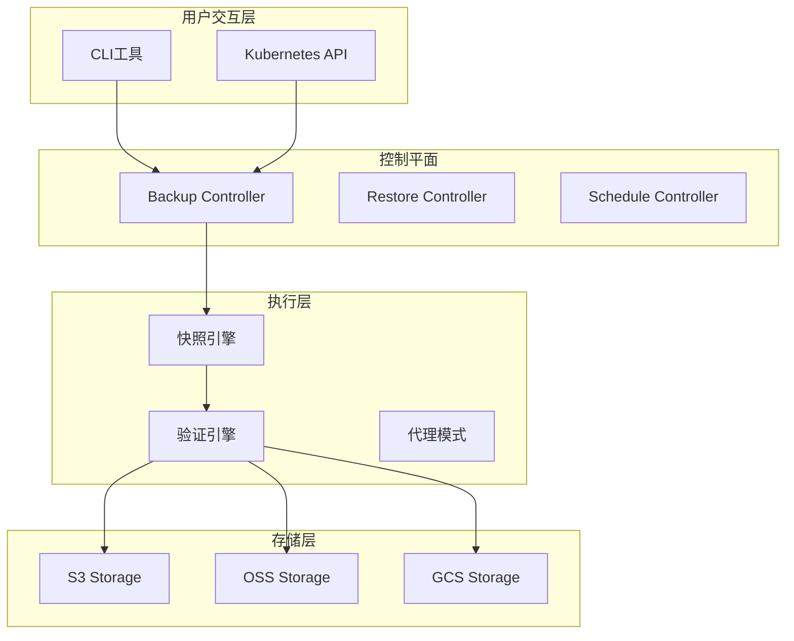

# EtcdGuardian

[](https://opensource.org/licenses/Apache-2.0)
[](https://goreportcard.com/report/github.com/etcdguardian/etcdguardian)
[](https://github.com/etcdguardian/etcdguardian/releases)

**EtcdGuardian** 是一个生产级的 Kubernetes Operator，专注于解决 Velero 在 etcd 备份领域的核心局限性。提供直接的 etcd 快照、增量备份、多租户隔离、托管 Kubernetes 支持和智能调度优化。

## ✨ 核心特性

### 🎯 解决 Velero 的核心痛点

- **直接 etcd 备份**：捕获完整的内部状态（历史修订、compaction 元数据、低级配置）
- **托管 Kubernetes 兼容**：支持 EKS、GKE、ACK 等托管环境的代理模式
- **自动验证机制**：快照完整性检查、一致性验证、哈希校验
- **增量备份支持**：基于 etcd watch API 的高效增量快照
- **性能优化**：流式传输、并发处理，支持大规模 etcd（10GB+）

### 🚀 企业级功能

- **多租户隔离**：基于 RBAC 的命名空间级备份权限控制
- **多云存储**：支持 S3、阿里云 OSS、GCS、Azure Blob
- **加密支持**：客户端加密、KMS 集成（AWS KMS、阿里云 KMS）
- **Velero 集成**：与 Velero 深度集成，同时保持独立运行能力
- **智能调度**：AI 驱动的备份频率优化（可选）
- **监控告警**：Prometheus 指标导出、多渠道告警（Slack、Email）

### 🌐 阿里云特别支持

- **ACK 托管环境**：针对阿里云容器服务的代理模式和兼容性优化
- **OSS 存储**：分片上传优化、RAM 角色认证、KMS 服务端加密
- **跨地域迁移**：支持 ACK 集群的跨地域备份和恢复

## 📋 快速开始

### 前置要求

- Kubernetes 集群（v1.21+）
- kubectl 已配置
- Helm 3.x（用于部署）
- 对象存储账号（S3/OSS/GCS/Azure）

### 安装

#### 方式 1：使用 Helm（推荐）

```bash
# 添加 Helm 仓库
helm repo add etcdguardian https://etcdguardian.io/charts
helm repo update

# 安装 EtcdGuardian Operator
helm install etcdguardian etcdguardian/etcdguardian \
  --namespace etcd-guardian-system \
  --create-namespace \
  --set storage.oss.enabled=true \
  --set storage.oss.bucket=my-etcd-backups \
  --set storage.oss.region=cn-hangzhou
```

#### 方式 2：从源码安装

```bash
# 克隆仓库
git clone https://github.com/etcdguardian/etcdguardian.git
cd etcdguardian

# 安装 CRDs
make install

# 部署 Operator
make deploy IMG=etcdguardian/operator:latest
```

### 创建第一个备份

#### 1. 准备存储凭证

```bash
# 对于 S3
kubectl create secret generic s3-credentials \
  --from-literal=access-key-id=<YOUR_ACCESS_KEY> \
  --from-literal=secret-access-key=<YOUR_SECRET_KEY> \
  -n etcd-guardian-system

# 对于阿里云 OSS
kubectl create secret generic oss-credentials \
  --from-literal=access-key-id=<YOUR_ALIYUN_AK> \
  --from-literal=access-key-secret=<YOUR_ALIYUN_SK> \
  -n etcd-guardian-system
```

#### 2. 创建备份资源

```yaml
apiVersion: etcdguardian.io/v1alpha1
kind: EtcdBackup
metadata:
  name: daily-backup
  namespace: etcd-guardian-system
spec:
  backupMode: Full
  storageLocation:
    provider: OSS
    bucket: my-etcd-backups
    region: cn-hangzhou
    credentialsSecret: oss-credentials
  validation:
    enabled: true
    consistencyCheck: true
  retentionPolicy:
    maxBackups: 30
    maxAge: 720h
```

```bash
kubectl apply -f backup.yaml
```

#### 3. 查看备份状态

```bash
kubectl get etcdbackup -n etcd-guardian-system
kubectl describe etcdbackup daily-backup -n etcd-guardian-system
```

### 从备份恢复

```yaml
apiVersion: etcdguardian.io/v1alpha1
kind: EtcdRestore
metadata:
  name: restore-from-incident
  namespace: etcd-guardian-system
spec:
  backupName: daily-backup
  restoreMode: Full
  etcdCluster:
    endpoints:
      - https://etcd-0:2379
      - https://etcd-1:2379
      - https://etcd-2:2379
    dataDir: /var/lib/etcd
  quiesceCluster: true
```

## 📊 架构概览



## 📖 使用示例

### 周期性备份

```yaml
apiVersion: etcdguardian.io/v1alpha1
kind: EtcdBackupSchedule
metadata:
  name: hourly-backup
spec:
  schedule: "0 * * * *"  # 每小时执行
  backupTemplate:
    spec:
      backupMode: Incremental
      storageLocation:
        provider: S3
        bucket: my-backups
        region: us-east-1
        credentialsSecret: s3-creds
  aiOptimization:
    enabled: true
    minInterval: 1h
    maxInterval: 6h
```

### 多租户备份

```yaml
apiVersion: etcdguardian.io/v1alpha1
kind: EtcdBackup
metadata:
  name: team-a-backup
  namespace: team-a
spec:
  backupMode: Full
  namespaceSelector:
    matchLabels:
      team: team-a
  storageLocation:
    provider: OSS
    bucket: team-a-backups
    region: cn-shanghai
    credentialsSecret: team-a-creds
```

### Velero 集成

```yaml
apiVersion: etcdguardian.io/v1alpha1
kind: EtcdBackup
metadata:
  name: full-cluster-backup
spec:
  backupMode: Full
  storageLocation:
    provider: S3
    bucket: cluster-backups
    region: us-west-2
    credentialsSecret: s3-creds
  veleroIntegration:
    enabled: true
    backupName: velero-backup-20260112
```

## 🔧 配置选项

### 存储后端配置

#### S3 Compatible

```yaml
storageLocation:
  provider: S3
  bucket: my-bucket
  region: us-east-1
  endpoint: https://minio.example.com  # 可选，用于 MinIO
  credentialsSecret: s3-credentials
```

#### 阿里云 OSS

```yaml
storageLocation:
  provider: OSS
  bucket: my-oss-bucket
  region: cn-hangzhou
  credentialsSecret: oss-credentials
encryption:
  enabled: true
  kmsKeyID: "acs:kms:cn-hangzhou:123456:key/abc-def"
```

### 加密配置

```yaml
encryption:
  enabled: true
  kmsKeyID: "arn:aws:kms:us-east-1:123456789:key/abc-def"  # 使用 KMS
  # OR
  encryptionSecret: my-encryption-key  # 客户端加密
```

## 🔍 监控与告警

### Prometheus 指标

EtcdGuardian 导出以下指标：

- `etcdguardian_backup_duration_seconds` - 备份耗时
- `etcdguardian_backup_size_bytes` - 快照大小
- `etcdguardian_backup_total` - 备份总数（按状态）
- `etcdguardian_etcd_db_size_bytes` - etcd 数据库大小
- `etcdguardian_validation_failures_total` - 验证失败次数

### 告警配置

```yaml
apiVersion: v1
kind: ConfigMap
metadata:
  name: etcdguardian-alerts
data:
  alerts.yaml: |
    groups:
      - name: etcdguardian
        rules:
          - alert: BackupFailure
            expr: rate(etcdguardian_backup_total{status="failed"}[5m]) > 0
            annotations:
              summary: "EtcdGuardian backup failed"
```

## 🛠️ 开发

### 构建项目

```bash
# 安装依赖
go mod download

# 生成代码
make generate

# 生成 CRD manifests
make manifests

# 构建二进制
make build

# 运行测试
make test

# 构建 Docker 镜像
make docker-build IMG=etcdguardian/operator:dev
```

### 本地运行

```bash
# 安装 CRDs 到集群
make install

# 本地运行 Operator
make run
```

## 📚 文档

- [架构设计](.qoder/quests/etcd-disaster-recovery-optimization.md)
- [API 参考](https://pkg.go.dev/github.com/etcdguardian/etcdguardian)
- [故障排查指南](docs/troubleshooting.md)
- [性能调优](docs/performance.md)

## 🤝 贡献

欢迎贡献！请查看 [CONTRIBUTING.md](CONTRIBUTING.md) 了解详情。

### 开发指南

1. Fork 本仓库
2. 创建特性分支 (`git checkout -b feature/amazing-feature`)
3. 提交更改 (`git commit -m 'Add amazing feature'`)
4. 推送到分支 (`git push origin feature/amazing-feature`)
5. 创建 Pull Request

## 📝 许可证

Apache License 2.0 - 详见 [LICENSE](LICENSE)

## 🙏 致谢

- [Velero](https://velero.io/) - 启发了本项目的设计
- [etcd](https://etcd.io/) - 核心依赖
- [Operator SDK](https://sdk.operatorframework.io/) - Operator 框架

## 📧 联系方式

- Issue Tracker: https://github.com/etcdguardian/etcdguardian/issues
- Discussions: https://github.com/etcdguardian/etcdguardian/discussions

---

**注意**：本项目当前处于活跃开发阶段。核心功能已实现，但部分高级特性仍在完善中。欢迎贡献和反馈！
